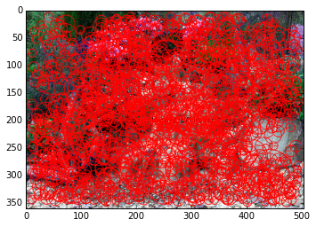

# Using SVM For Image Classification

The goal of this project to use SVM to accurately classify images. The original data set chosen was the NOAA Right Whale Recognition images from a Kaggle contest (https://www.kaggle.com/c/noaa-right-whale-recognition). The goal of the Kaggle contest was to assign an ID number to each whale. The training data set was manually constructed by NOAA. **Spoiler Alert** The right whale classification didn't produce very accurate results.

The CalTech 256 images (http://authors.library.caltech.edu/7694/) are also for some examples after it became apparent that the right whale project was a bit too ambitious. This data set is collection of images (around 100 each) of different objects.

Classification of both data sets follows the same general approach:

1. Crop images to remove extraneous information (if necessary).
2. Extract SURF features from all images.
3. Use K-Means clustering create K cluster centers from all images.
4. For each image create a histogram of SURF features based on the cluster centers from step 4.
5. Train the SVM model using K-Folds and various combinations of kernels and penalty parameters.
6. Evaluate the models and select the best set of SVM parameters.

## Right Whale Attempt

### Data 

For this run I am going using 500 out of the 4,500 total images. The NOAA provided a spreadsheet that assigns whale ID numbers to each of the training images. There are a couple of scripts in the accompanying zip file that were used for preprocessing and sorting.

On the file system there is a folder for whale ID and it contains the images of that specific whale. The image sizes and quality ranges greatly. I also did some manual trimming to remove any images of open sea from the image cropping stage.

### Image Cropping

The whale image cropping is primarily a computer vision problem. I am using a technique outlined here:
https://github.com/eduardofv/whale_detector/blob/master/hist_zones.py

I won't go into much detail since it's really related to the class topics. I needed to modify the code quite a bit to work with Python 2.7 and the different version of OpenCV. Here is the workflow:

1. Load the image.
2. Convert to HSV.
3. Extract the color histogram from the image.
4. Color the image black.
5. Divide the image into sections.
6. Calculate a correlation between the between image section and the base image. This is done recursively in each image section.
7. Color areas with low correlation white.
8. Once the full image is analyzed, denoise the image.
9. Find the contours in the white/black image.
10. Select the largest region.

This approach "works" because the images are of right whales in the open ocean, so they are the prominent feature in most of the images. However, this approach does run into some issues when there is a lot of wake or breaking waves.

#### Image Cropping Code


```python
images = ["Images/w_4678.jpg","Images/w_8706.jpg"]
%matplotlib inline

```


```python
import cv2

def crop_by_color_histogram(image, output_path):
    """
    From: https://github.com/eduardofv/whale_detector/blob/master/hist_zones.py
    """
    print "Cropping image %s" % image
    img = load_image(image)
    original_image = np.copy(img)

    im = cv2.cvtColor(img, cv2.COLOR_BGR2HSV)
    hist = get_color_histogram(im)
    mask_image(im, hist)

    cleaned_image = clean_image(im)
    best_region = find_best_region(cleaned_image)
    cropped_image = crop_image_from_region(original_image, best_region)

    cv2.imwrite(output_path, cropped_image)

```

This function contains the primary logic for cropping images. It is called on each image.

#### Load the Image


```python
import os

from matplotlib import pyplot as plt

def load_image(image_path):
    if type(image_path) == str and os.path.exists(image_path):
        img = cv2.imread(image_path, cv2.CV_LOAD_IMAGE_COLOR)
        # Denoising really increases the image loading times. In testing it
        # produced much better results however the I didn't have enough time to run
        # run the models using that feature.
        # img = cv2.fastNlMeansDenoisingColored(img)
    elif type(image_path) == np.ndarray:
        img = image_path
    else:
        raise Exception("Invalid image found.")

    return img

original_image = load_image("Images/w_4678.jpg")
plt.imshow(original_image)
plt.show()
```


Images are loaded in color, using the denoising does increase the end matching percentage but it comes a significant performance cost. None of the results presented in this notebook contain data that was denoised.

#### Create Color Histogram


```python
def get_color_histogram(image):
    return cv2.calcHist( [image], [0, 1], None, [180, 256], [0, 180, 0, 256] )
```

#### Mask the Image


```python
def set_color(image, color):
    for i in range(0, 3):
        image[:, :, i] = color

        
def divide_image(image):
    try:
        height, width, _ = image.shape
    except ValueError:
        height, width = image.shape

    section1 = image[0:height / 2, 0:width / 2]
    section2 = image[0:height / 2, width / 2:width]
    section3 = image[height / 2:height, 0:width / 2]
    section4 = image[height / 2:height, width / 2:width]
    return [section1, section2, section3, section4]

        
def mask_image(image, hist):
    height, width, channels = image.shape
    if width < 10 or height < 10:
        set_color(image, 0)
        return

    sectioned_image = divide_image(image)
    correlation = [cv2.compareHist(hist, get_color_histogram(imx), cv2.cv.CV_COMP_CORREL) for imx in sectioned_image]

    for index, section in enumerate(sectioned_image):
        if correlation[index] < 0.25:
            set_color(section, 255)
        else:
            correlation.append(mask_image(section, hist))

    return correlation

im = load_image("Images/w_4678.jpg")
histogram = get_color_histogram(im)
mask_image(im, histogram)
plt.imshow(im)
plt.show()

```


#### Clean Image


```python
import numpy as np

def clean_image(image):
    kernel = np.ones((40, 40), np.uint8)
    image = cv2.erode(image, kernel, iterations=1)
    return cv2.dilate(image, kernel, iterations=1)

cleaned_image = clean_image(im)
plt.imshow(cleaned_image)
plt.show()

```


#### Find Best Region


```python
def find_best_region(image):
    image = cv2.cvtColor(image, cv2.COLOR_BGR2GRAY)
    ret, thresh = cv2.threshold(image, 127, 255, 0)
    contours, hierarchy = cv2.findContours(thresh, cv2.RETR_EXTERNAL, cv2.CHAIN_APPROX_SIMPLE)
    best = None
    best_size = 0
    for cnt in contours:
        x, y, w, h = cv2.boundingRect(cnt)
        size = w * h
        if size > best_size:
            best_size = size
            best = cnt

    return best

```

#### Crop Image


```python
def crop_image_from_region(image, region):
    x, y, w, h = cv2.boundingRect(region)
    return image[y: y + h, x: x + w]

best_region = find_best_region(cleaned_image)
cropped_image = crop_image_from_region(original_image, best_region)
plt.imshow(cropped_image)
plt.show()

```


```python
map(lambda x: crop_by_color_histogram(x, "Images/CroppedImages/%s" % os.path.split(x)[1]), images)
cropped_images = map(lambda x: "Images/CroppedImages/%s" % os.path.split(x)[1], images)
```

    Cropping image Images/w_4678.jpg
    Cropping image Images/w_8706.jpg


The image cropping worked very well overall. However, there were a number of images that did not crop successfully and resulted in images of open ocean. The above code snipet will run a few images through the cropping function and save them to disk for later examples in the notebook.

### Extracting Features

Two techniques will be used for classifying the images. Spatial histogram and visual bag of words.

**Spatial histograms** are generally used when the location of a feature in an image is important. The process is fairly simple.

1. Use SURF to extract key points and descriptors.
2. Using k-means cluster the full set of descriptors into $k$ clusters.
3. Section the image into 4 regions.
4. For each section use k-means clustering, with the cluster centers from step used for initialization, to build a histogram of features.
5. Concatenate the histograms into a $k$ x 4 matrix.
6. Use that matrix as an input into a classifier (SVM in this case).

The **visual bag of words** is very similar, except instead of four histograms only one is created and it represents the entire image. This approach is best when the entire image contains relevant features. Here is the approach:

1. Use SURF to extract key points and descriptors.
2. Using k-means cluster the full set of descriptors into $k$ clusters.
3. For each image use k-means clustering, with the cluster centers from step used for initialization, to build a histogram of features.
4. Use that vector as the an input into a classifier.

In this histogram building code spatial histograms are always created. Then before running the classifier the features are either vectorized into spatial histograms or into a full bag of words. To construct a bag words from the spatial histograms the histograms just need to be added together.

#### Extract Features with SURF

There are two ways that SURF features are extracted in this project, sparse and dense. Sparse detection only finds the key points/descriptors at areas of interest in the image. Dense detection grids the entire image with key points and calculates the descriptors over the entire image.

Because the first step is to find $k$ cluster centers across the entire set of images I used a generator function (extract_image_features_stream) to lazily build an iterator of descriptors to feed into a mini batch k-means clusterer.


```python
def detect_compute_surf(img, surf, spread):
    if spread == 'dense':
        dense = cv2.FeatureDetector_create("Dense")
        kp = dense.detect(img)
        kp, des = surf.compute(img, kp)
    else:
        kp, des = surf.detectAndCompute(img, None)

    return kp, des


def run_surf(image_path, spread='dense', value=400):
    img = load_image(image_path)

    des = None
    kp = None
    attempts = 0
    while des is None:
        surf = cv2.SURF(value)
        kp, des = detect_compute_surf(img, surf, spread)

        if kp is not None and des is not None:
            break

        value *= 0.9
        print "SURF detected no features for %s re-running at %f" % (image_path, value)
        attempts += 1

    return kp, des


def extract_image_features_stream(spread, image_list):
    for image in image_list:
        print "Extracting SURF for image %s" % image
        kp, des = run_surf(image, spread=spread)

        if kp is not None and des is not None:
            yield kp, np.asarray(des)

```

#### Sparse SURF


```python
for index, (kps, des) in enumerate(extract_image_features_stream('sparse', images)):
    img = load_image(images[index])
    image_with_keys = cv2.drawKeypoints(img, kps, None, (255, 0, 0), 4)
    plt.imshow(image_with_keys)
    plt.show()

```

    Extracting SURF for image Images/w_4678.jpg


    Extracting SURF for image Images/w_8706.jpg


```python
for index, (kps, des) in enumerate(extract_image_features_stream('sparse', cropped_images)):
    img = load_image(cropped_images[index])
    image_with_keys = cv2.drawKeypoints(img, kps, None, (255, 0, 0), 4)
    plt.imshow(image_with_keys)
    plt.show()

```

    Extracting SURF for image Images/CroppedImages/w_4678.jpg


    Extracting SURF for image Images/CroppedImages/w_8706.jpg


#### Dense SURF


```python
for index, (kps, des) in enumerate(extract_image_features_stream('dense', images)):
    img = load_image(images[index])
    image_with_keys = cv2.drawKeypoints(img, kps, None, (255, 0, 0), 4)
    plt.imshow(image_with_keys)
    plt.show()

```

    Extracting SURF for image Images/w_4678.jpg


    Extracting SURF for image Images/w_8706.jpg


```python
for index, (kps, des) in enumerate(extract_image_features_stream('dense', cropped_images)):
    img = load_image(cropped_images[index])
    image_with_keys = cv2.drawKeypoints(img, kps, None, (255, 0, 0), 4)
    plt.imshow(image_with_keys)
    plt.show()

```

    Extracting SURF for image Images/CroppedImages/w_4678.jpg


    Extracting SURF for image Images/CroppedImages/w_8706.jpg


The differences between the approaches are very apparent in the images. Dense analyzes the entire image and returns a set of descriptors that describe the entire image. Sparse only looks at "interesting" points in the image. Interesting areas are determined by the SURF algorithm, which is out of scope for this document.

The SURF detection returns two lists. One is a list of the KeyPoint object, these objects contain information about the size and location of the key point. The other is a list of descriptors, these are 128-dimension elements that describe the pixels inside of the key point area.

### Cluster Features

Once the feature extraction is completed the key point descriptors need to be clustered. This is because sparse SURF returns a variable number of descriptors per image and because the dense approach creates a dataset of huge dimensionality (plus the number of key points in dense SURF is dependent on the image size).

For those reasons we will create a vocabulary from the full set of descriptors using k-means. This will give us a way to classify each key point in each image. Because the data set large mini batch k-means will be used and SURF feature detection will be performed lazily to limit the memory footprint.


```python
import numpy as np
from sklearn.cluster import MiniBatchKMeans, KMeans


def get_kmeans_cluster(k, cluster_centers):
    return KMeans(n_clusters=k, max_iter=100, init=cluster_centers, n_init=1)


def get_mini_batch_cluster(k):
    return MiniBatchKMeans(init='k-means++', n_clusters=k, max_iter=100, batch_size=50)


def cluster_key_points_from_stream(image_data, k):
    print "Clustering Image Features to %s clusters" % k
    km = get_mini_batch_cluster(k)

    descriptors = []
    for index, (kp, des) in enumerate(image_data):
        descriptors.append(des)

        if index % 100 == 0:
            descriptors = np.vstack(descriptors)
            km.partial_fit(descriptors)
            descriptors = []
    
    descriptors = np.vstack(descriptors)
    km.partial_fit(descriptors)

    return km.cluster_centers_

```


```python
feature_stream = extract_image_features_stream("sparse", cropped_images)
cluster_centers = cluster_key_points_from_stream(feature_stream, 50)

print cluster_centers
```

    Clustering Image Features to 50 clusters
    Extracting SURF for image Images/CroppedImages/w_4678.jpg
    Extracting SURF for image Images/CroppedImages/w_8706.jpg
    [[  3.71566468e-04   2.43468657e-03  -4.30781181e-04 ...,   2.60476062e-03
       -4.63288480e-04   2.46293986e-03]
     [  6.63069141e-04   2.09387044e-03  -1.30775082e-04 ...,   2.03612368e-03
       -4.96398585e-05   2.51205205e-03]
     [  2.20976993e-03   3.72785814e-03   4.95237643e-03 ...,   9.51399375e-04
       -2.59765609e-03   3.70087521e-03]
     ..., 
     [ -2.43435885e-04   4.05497150e-03  -5.63438050e-04 ...,   4.92715740e-03
        5.41881280e-04   1.10420589e-03]
     [ -4.03825456e-04   9.71183705e-04   5.44564042e-04 ...,   1.47310062e-03
       -7.31786602e-04   1.05029110e-03]
     [ -8.54429323e-04   5.99187426e-03   1.04760774e-03 ...,   4.82028894e-04
       -1.31156854e-03   1.54299879e-03]]


With these clusters we can build a histogram for each image individually. Each center will represent a bin in the histogram. The centers are difficult to represent visually because they 128 dimensions.

### Build Histograms

The histograms that we build in this stage will be fed into the classifiers. By default will build spatial histograms for each image, if we want to run a bag-of-words classification we can simply merge all of the histograms before running them through the classifier.

Each histogram is represented as a Python dictionary (which will be vectorized before running the SVM model).


```python
def build_histogram(data, k):
    histograms = get_base_histogram(k)
    for element in data:
        histograms[element] += 1
    return histograms


def get_base_histogram(k):
    histogram = {}
    for x in xrange(0, k):
        histogram[x] = 0
    return histogram


def build_image_histograms(surf_spread, k, cluster_centers, descriptors_lookup):
    X = []
    y = []
    km = get_kmeans_cluster(k, cluster_centers)

    for image_path in descriptors_lookup:
        print "Building Histogram for %s" % image_path
        image_id = os.path.split(os.path.dirname(image_path))[1]
        img = load_image(image_path)
        sections = divide_image(img)

        if surf_spread == 'sparse':
            sections = [img]

        histograms = []
        for section in sections:
            kp, des = run_surf(section, surf_spread)
            surf_value = 400
            attempts = 0
            completed = False

            while attempts < 10 and not completed:
                try:
                    descriptors = np.vstack(des)
                    km.fit(descriptors)
                    completed = True
                except:
                    print "Re-running %s with SURF value set to: %i" % (image_path, surf_value)
                    surf_value *= 0.80
                    attempts += 1
                    des = run_surf(section, surf_spread)[1]

            if completed:
                histogram = build_histogram(km.labels_, k)
                histograms.append(histogram)
            else:
                print "Could not extract enough features from image %s for processing" % image_path
                histogram = build_histogram([], k)
                histograms.append(histogram)

        if len(histograms) == 4 or (surf_spread == 'sparse' and len(histograms) == 1):
            X.append(histograms)
            y.append(image_id)

    return X, y
```

This is the complicated function for running KMeans. The problem that I was running into is that every image didn't always have a number of key points > K. So I setup an iterative approach to decrease the Hessian value for SURF (making it more sensisitve to changes in the images).

The key to this function is the very first line where we initialize the KMeans object. The important parameters are init=cluster_centers, n_init=1 which loads the cluster centers from the previous step. The n_init=1 just gets rid of a warning that is printed when initializing KMeans with known cluster centers.

After clustering finishes, we build the histogram with the **histogram = build\_histogram(km.labels\_, k)** line. That function initializes a histograms with zero for each bin and then totals the counts.

The whale ID (image_id in the code) is determined from the folder name that the image is stored. All of the images are sorted by whale ID at the beginning of the process.


```python
labeled_X, labeled_y = build_image_histograms("dense", 50, cluster_centers, cropped_images)
for sections in labeled_X:
    fig, ((ax1, ax2), (ax3, ax4)) = plt.subplots(nrows=2, ncols=2)
    fig.suptitle('Spatial Histograms', fontsize=14, fontweight='bold')
    ax1.bar(sections[0].keys(), sections[0].values(), 1.0, color='g')
    ax2.bar(sections[1].keys(), sections[1].values(), 1.0, color='g')
    ax3.bar(sections[2].keys(), sections[2].values(), 1.0, color='g')
    ax4.bar(sections[3].keys(), sections[3].values(), 1.0, color='g')

```

    Building Histogram for Images/CroppedImages/w_4678.jpg
    Building Histogram for Images/CroppedImages/w_8706.jpg


Here is the code used for merging the histograms and building the full bag of words for each image.


```python
def merge_histograms(image_data):
    merged_data = []
    for histograms in image_data:
        merged_histogram = get_base_histogram(len(image_data[0][0].keys()))
        for histogram_bin in merged_histogram:
            for histogram in histograms:
                merged_histogram[histogram_bin] += histogram[histogram_bin]
        merged_data.append(merged_histogram)

    return merged_data

```


```python
labeled_X, labeled_y = build_image_histograms("dense", 50, cluster_centers, cropped_images)
merged_histograms = merge_histograms(labeled_X)
for histogram in merged_histograms:
    plt.suptitle('Bag of Words Histograms', fontsize=14, fontweight='bold')
    plt.bar(histogram.keys(), histogram.values(), 1.0, color='g')
    plt.show()

```

    Building Histogram for Images/CroppedImages/w_4678.jpg
    Building Histogram for Images/CroppedImages/w_8706.jpg


Once histograms are constructed for every image we can then start training our model.

### Train the Models

Because there was a large data set much of the processing was done outside of this notebook, however the full set of code can be found in the accompanying zip archive. Intermediate data was stored to disk using npy files. The output scores were pickled into Pandas data frames.

The table below contains the different configurations ran on the whale dataset.


#### Configurations

SURF|k|Vectorization|KFolds
-|-|-|-
Dense|25|Bag of Words|Strat
Dense|50|Bag of Words|Strat
Dense|100|Bag of Words|Strat
Sparse|25|Bag of Words|Strat
Sparse|50|Bag of Words|Strat
Dense|50|Spatial Histogram|Strat
Sparse|50|Spatial Histogram|Strat


#### Storing and Loading Data


```python
import os
import numpy as np

NP_SAVE_LOCATION = "data/Whale"
CLUSTER_CENTER_NAME = "cluster-centers"
LABELED_PREDICTORS = "labeled-predictors"
LABELED_RESPONSE = "labeled-response"


def save_np_file(data, file_name, run_name):
    file_path = os.path.join(NP_SAVE_LOCATION, "%s_%s" % (file_name, run_name))

    if not os.path.exists(NP_SAVE_LOCATION):
        os.makedirs(NP_SAVE_LOCATION)

    with open(file_path, 'wb') as out_file:
        np.save(out_file, data)


def load_np_file(file_name, run_name):
    file_path = os.path.join(NP_SAVE_LOCATION, "%s_%s" % (file_name, run_name))

    with open(file_path, 'rb') as in_file:
        return np.load(in_file)
```

Numpy data was saved to and loaded from disk using these functions. The intermediate data stored was the cluster centers used for building the histograms and the X and y data (spatial histograms) that will be feed through the models.

Let's load up the first configuration from the Configurations table.


```python
# This is the histogram data from the last step
labeled_X = load_np_file(LABELED_PREDICTORS, "whale_25_sparse")
labeled_y = load_np_file(LABELED_RESPONSE, "whale_25_sparse")

```

#### Statistical Models Used

The models evaluated were **SVM** (using the poly, RBF, sigmoid, and laplacian kernels), **Random Forest**, **Naive Bayes**, and **Gradient Boosting**. K-Folds was used during cross validation, typically stratified K-folds was used due to the distribution of the dataset (the number of images per whale varied from 20 or more and 2) and I wanted to have at least one image for each whale in the test datasets due to difficulty of the problem. Using the standard K-fold might be a better choice when evaluating this model for actual use since it may better represent the actual data.

Evaluation of the models was very straight-forward, the average of the accuracy score for each fold was used to select the best model. 

#### Cross Validation


```python
from collections import Counter

from sklearn.cross_validation import KFold, StratifiedKFold


def get_kfold(y, n_folds=5):
    counts = Counter(y)
    if n_folds > min(counts.values()):
        n_folds = min(counts.values())

    return KFold(len(y), n_folds=n_folds)


def get_stratified_fold(y, n_folds=5):
    counts = Counter(y)
    if n_folds > min(counts.values()):
        n_folds = min(counts.values())

    return StratifiedKFold(y, n_folds=n_folds)

```

Typically 5 folds were used for the data. However, for the CalTech image data there were often less than 5 classes so logic was included to make sure the number of folds did not exceed the number of classes. For the whale images this was never an issue.

#### Vectorization


```python
import numpy as np

from sklearn.feature_extraction import DictVectorizer


def determine_vectorization_strategy(vectorization_type):
    if vectorization_type == 'spatial_histogram':
        return vectorize_multi_histograms
    elif vectorization_type == 'bag_of_words':
        return merge_and_vectorize_features


def merge_and_vectorize_features(X):
    vectorizer = DictVectorizer()
    X = merge_histograms(X)
    return vectorizer.fit_transform(X).todense()


def vectorize_multi_histograms(X):
    vectorizer = DictVectorizer()
    holder = []
    for x in X:
        holder.append(vectorizer.fit_transform(x).todense())

    return np.vstack(holder)

```


```python
vectorization_strategy = determine_vectorization_strategy("bag_of_words")
```

For each run a vectorization strategy was defined. This is where we decide if we are going to run the classification using spatial histograms or the full image bag of words. Because the histograms are all Python Dictionary objects they need to be converted by the DictVectorizer into numpy objects before they can be fed into a model.

#### Train Models


```python
import math

from sklearn.svm import SVC
from sklearn.ensemble import RandomForestClassifier
from sklearn.ensemble import GradientBoostingClassifier
from sklearn.naive_bayes import MultinomialNB


def train_naive_bayes(X, y, kfold, vectorization_strategy):
    print "Training Naive Bayes"

    X = vectorization_strategy(X)
    clf = MultinomialNB()

    scores = []
    for train, test in kfold:
        score = clf.fit(X[train], y[train]).score(X[test], y[test])
        scores.append(score)

    return scores


def train_gradient_boosting_classifier(X, y, kfold, vectorization_strategy):
    print "Training Boost Model"

    X = vectorization_strategy(X)
    clf = GradientBoostingClassifier(n_estimators=100)

    scores = []
    for train, test in kfold:
        score = clf.fit(X[train], y[train]).score(X[test], y[test])
        scores.append(score)

    return scores


def train_svm(X, y, kernel, C, kfold, vectorization_strategy):

    X = vectorization_strategy(X)
    clf = SVC(kernel=kernel, C=C)

    scores = []
    for train, test in kfold:
        score = clf.fit(X[train], y[train]).score(X[test], y[test])
        scores.append(score)

    return scores


def train_forest(X, y, kfold, vectorization_strategy):
    print "Training Random Forest Model"

    X = vectorization_strategy(X)
    clf = RandomForestClassifier(n_estimators=20)

    scores = []
    for train, test in kfold:
        score = clf.fit(X[train], y[train]).score(X[test], y[test])
        scores.append(score)

    return scores

```

This is the code used to train each of the statistical models. Each function requires the predictor variables (X), the response variables (y), the K-folds (kfold), and a vectorization strategy (vectorization_strategy). The SVM model also take a combination of penalty values and kernels.

Each function returns a list of the accuracy scores for each fold.

#### Custom Kernel

Here is an example implementation of a custom kernel. The Laplacian kernel is not available in my version of SKLearn, so I took the function from their dev branch and brought into my code. There were some papers that showed SVM models with this kernel outperforming other SVM like RBF.


```python
import numpy as np

from sklearn.metrics import pairwise


def laplacian_kernel(X, Y=None, gamma=None):
    """Compute the laplacian kernel between X and Y.
    The laplacian kernel is defined as::
        K(x, y) = exp(-gamma ||x-y||_1)
    for each pair of rows x in X and y in Y.
    Read more in the :ref:`User Guide <laplacian_kernel>`.
    .. versionadded:: 0.17
    Parameters
    ----------
    X : array of shape (n_samples_X, n_features)
    Y : array of shape (n_samples_Y, n_features)
    gamma : float
    Returns
    -------
    kernel_matrix : array of shape (n_samples_X, n_samples_Y)
    """
    X, Y = pairwise.check_pairwise_arrays(X, Y)
    if gamma is None:
        gamma = 1.0 / X.shape[1]

    K = -gamma * pairwise.manhattan_distances(X, Y)
    np.exp(K, K)    # exponentiate K in-place
    return K


```

This is the code that trains all of the models and stores the accuracy scores in a Pandas data frame.


```python
import pandas as pd
from collections import OrderedDict

k = 25
stratified_kfold = True

if stratified_kfold:
    kfold = get_stratified_fold(labeled_y)
else:
    kfold = get_kfold(labeled_y)

scores = OrderedDict()
bayes_score = train_naive_bayes(labeled_X, labeled_y, kfold, vectorization_strategy)
bayes_score.append(np.mean(bayes_score))
scores["Naive Bayes"] = bayes_score

forest_score = train_forest(labeled_X, labeled_y, kfold, vectorization_strategy)
forest_score.append(np.mean(forest_score))
scores["Random Forest"] = forest_score

boost_score = train_gradient_boosting_classifier(labeled_X, labeled_y, kfold, vectorization_strategy)
boost_score.append(np.mean(boost_score))
scores["Gradient Boosting"] = boost_score

print "Training SVM Model"
kernels = ['poly', 'rbf', 'sigmoid', laplacian_kernel]
penalties = [0.01, 1, 100, 1000, 10000]
for kernel in kernels:
    for penalty in penalties:
        score = train_svm(labeled_X, labeled_y, kernel, penalty, kfold, vectorization_strategy)
        score.append(np.mean(score))
        scores["%s_%s_%i" % ('SVM', str(kernel), penalty)] = score

for run in scores:
    print run, scores[run]
```

    Training Naive Bayes
    Training Random Forest Model
    Training Boost Model
    Training SVM Model
    Naive Bayes [0.037037037037037035, 0.04878048780487805, 0.042908762420957543]
    Random Forest [0.055555555555555552, 0.073170731707317069, 0.064363143631436304]
    Gradient Boosting [0.07407407407407407, 0.081300813008130079, 0.077687443541102075]
    SVM_poly_0 [0.044444444444444446, 0.06097560975609756, 0.052710027100271006]
    SVM_poly_1 [0.044444444444444446, 0.06097560975609756, 0.052710027100271006]
    SVM_poly_100 [0.044444444444444446, 0.06097560975609756, 0.052710027100271006]
    SVM_poly_1000 [0.044444444444444446, 0.06097560975609756, 0.052710027100271006]
    SVM_poly_10000 [0.044444444444444446, 0.06097560975609756, 0.052710027100271006]
    SVM_rbf_0 [0.044444444444444446, 0.04878048780487805, 0.046612466124661245]
    SVM_rbf_1 [0.044444444444444446, 0.04878048780487805, 0.046612466124661245]
    SVM_rbf_100 [0.044444444444444446, 0.04878048780487805, 0.046612466124661245]
    SVM_rbf_1000 [0.044444444444444446, 0.04878048780487805, 0.046612466124661245]
    SVM_rbf_10000 [0.044444444444444446, 0.04878048780487805, 0.046612466124661245]
    SVM_sigmoid_0 [0.044444444444444446, 0.04878048780487805, 0.046612466124661245]
    SVM_sigmoid_1 [0.044444444444444446, 0.04878048780487805, 0.046612466124661245]
    SVM_sigmoid_100 [0.044444444444444446, 0.04878048780487805, 0.046612466124661245]
    SVM_sigmoid_1000 [0.044444444444444446, 0.04878048780487805, 0.046612466124661245]
    SVM_sigmoid_10000 [0.044444444444444446, 0.04878048780487805, 0.046612466124661245]
    SVM_<function laplacian_kernel at 0x10d66c1b8>_0 [0.044444444444444446, 0.04878048780487805, 0.046612466124661245]
    SVM_<function laplacian_kernel at 0x10d66c1b8>_1 [0.044444444444444446, 0.04878048780487805, 0.046612466124661245]
    SVM_<function laplacian_kernel at 0x10d66c1b8>_100 [0.044444444444444446, 0.04878048780487805, 0.046612466124661245]
    SVM_<function laplacian_kernel at 0x10d66c1b8>_1000 [0.044444444444444446, 0.04878048780487805, 0.046612466124661245]
    SVM_<function laplacian_kernel at 0x10d66c1b8>_10000 [0.044444444444444446, 0.04878048780487805, 0.046612466124661245]


### Evaluate Model


```python
import os
import pandas as pd
from IPython.display import display, HTML

data_folder = "data/Whale/Output"
outputs = os.listdir(data_folder)
best_runs = []

for output in outputs:
    file_path = os.path.join(data_folder, output)
    df = pd.read_pickle(file_path)
    new_list = []
    for index,row in df.iterrows():
        name = [row[0]]
        data = list(row[1])
        name.extend(data)
        new_list.append(name)
        
    best_run = max(new_list, key=lambda x: float(x[-1]))
    best_run = [output] + best_run
    best_runs.append(best_run)

    formatted_df = pd.DataFrame.from_records(new_list)
    formatted_df.columns = ['%s Model' % output, 'Run1Acc', 'Run2Acc','AverageAcc']
    display(formatted_df)
```


<div>
<table border="1" class="dataframe">
  <thead>
    <tr style="text-align: right;">
      <th></th>
      <th>output_whale_100_dense Model</th>
      <th>Run1Acc</th>
      <th>Run2Acc</th>
      <th>AverageAcc</th>
    </tr>
  </thead>
  <tbody>
    <tr>
      <th>0</th>
      <td>Naive Bayes</td>
      <td>0.048148</td>
      <td>0.036585</td>
      <td>0.042367</td>
    </tr>
    <tr>
      <th>1</th>
      <td>Random Forest</td>
      <td>0.096296</td>
      <td>0.077236</td>
      <td>0.086766</td>
    </tr>
    <tr>
      <th>2</th>
      <td>Gradient Boosting</td>
      <td>0.051852</td>
      <td>0.065041</td>
      <td>0.058446</td>
    </tr>
    <tr>
      <th>3</th>
      <td>SVM_poly_0</td>
      <td>0.070370</td>
      <td>0.113821</td>
      <td>0.092096</td>
    </tr>
    <tr>
      <th>4</th>
      <td>SVM_poly_1</td>
      <td>0.070370</td>
      <td>0.113821</td>
      <td>0.092096</td>
    </tr>
    <tr>
      <th>5</th>
      <td>SVM_poly_100</td>
      <td>0.070370</td>
      <td>0.113821</td>
      <td>0.092096</td>
    </tr>
    <tr>
      <th>6</th>
      <td>SVM_poly_1000</td>
      <td>0.070370</td>
      <td>0.113821</td>
      <td>0.092096</td>
    </tr>
    <tr>
      <th>7</th>
      <td>SVM_poly_10000</td>
      <td>0.070370</td>
      <td>0.113821</td>
      <td>0.092096</td>
    </tr>
    <tr>
      <th>8</th>
      <td>SVM_rbf_0</td>
      <td>0.044444</td>
      <td>0.048780</td>
      <td>0.046612</td>
    </tr>
    <tr>
      <th>9</th>
      <td>SVM_rbf_1</td>
      <td>0.044444</td>
      <td>0.048780</td>
      <td>0.046612</td>
    </tr>
    <tr>
      <th>10</th>
      <td>SVM_rbf_100</td>
      <td>0.044444</td>
      <td>0.048780</td>
      <td>0.046612</td>
    </tr>
    <tr>
      <th>11</th>
      <td>SVM_rbf_1000</td>
      <td>0.044444</td>
      <td>0.048780</td>
      <td>0.046612</td>
    </tr>
    <tr>
      <th>12</th>
      <td>SVM_rbf_10000</td>
      <td>0.044444</td>
      <td>0.048780</td>
      <td>0.046612</td>
    </tr>
    <tr>
      <th>13</th>
      <td>SVM_sigmoid_0</td>
      <td>0.044444</td>
      <td>0.048780</td>
      <td>0.046612</td>
    </tr>
    <tr>
      <th>14</th>
      <td>SVM_sigmoid_1</td>
      <td>0.044444</td>
      <td>0.048780</td>
      <td>0.046612</td>
    </tr>
    <tr>
      <th>15</th>
      <td>SVM_sigmoid_100</td>
      <td>0.044444</td>
      <td>0.048780</td>
      <td>0.046612</td>
    </tr>
    <tr>
      <th>16</th>
      <td>SVM_sigmoid_1000</td>
      <td>0.044444</td>
      <td>0.048780</td>
      <td>0.046612</td>
    </tr>
    <tr>
      <th>17</th>
      <td>SVM_sigmoid_10000</td>
      <td>0.044444</td>
      <td>0.048780</td>
      <td>0.046612</td>
    </tr>
    <tr>
      <th>18</th>
      <td>SVM_&lt;function laplacian_kernel at 0x108430a28&gt;_0</td>
      <td>0.044444</td>
      <td>0.048780</td>
      <td>0.046612</td>
    </tr>
    <tr>
      <th>19</th>
      <td>SVM_&lt;function laplacian_kernel at 0x108430a28&gt;_1</td>
      <td>0.044444</td>
      <td>0.048780</td>
      <td>0.046612</td>
    </tr>
    <tr>
      <th>20</th>
      <td>SVM_&lt;function laplacian_kernel at 0x108430a28&gt;...</td>
      <td>0.044444</td>
      <td>0.048780</td>
      <td>0.046612</td>
    </tr>
    <tr>
      <th>21</th>
      <td>SVM_&lt;function laplacian_kernel at 0x108430a28&gt;...</td>
      <td>0.044444</td>
      <td>0.048780</td>
      <td>0.046612</td>
    </tr>
    <tr>
      <th>22</th>
      <td>SVM_&lt;function laplacian_kernel at 0x108430a28&gt;...</td>
      <td>0.044444</td>
      <td>0.048780</td>
      <td>0.046612</td>
    </tr>
  </tbody>
</table>
</div>


<div>
<table border="1" class="dataframe">
  <thead>
    <tr style="text-align: right;">
      <th></th>
      <th>output_whale_100_sparse Model</th>
      <th>Run1Acc</th>
      <th>Run2Acc</th>
      <th>AverageAcc</th>
    </tr>
  </thead>
  <tbody>
    <tr>
      <th>0</th>
      <td>Naive Bayes</td>
      <td>0.077778</td>
      <td>0.052846</td>
      <td>0.065312</td>
    </tr>
    <tr>
      <th>1</th>
      <td>Random Forest</td>
      <td>0.059259</td>
      <td>0.052846</td>
      <td>0.056052</td>
    </tr>
    <tr>
      <th>2</th>
      <td>Gradient Boosting</td>
      <td>0.029630</td>
      <td>0.052846</td>
      <td>0.041238</td>
    </tr>
    <tr>
      <th>3</th>
      <td>SVM_poly_0</td>
      <td>0.055556</td>
      <td>0.060976</td>
      <td>0.058266</td>
    </tr>
    <tr>
      <th>4</th>
      <td>SVM_poly_1</td>
      <td>0.055556</td>
      <td>0.065041</td>
      <td>0.060298</td>
    </tr>
    <tr>
      <th>5</th>
      <td>SVM_poly_100</td>
      <td>0.055556</td>
      <td>0.065041</td>
      <td>0.060298</td>
    </tr>
    <tr>
      <th>6</th>
      <td>SVM_poly_1000</td>
      <td>0.055556</td>
      <td>0.065041</td>
      <td>0.060298</td>
    </tr>
    <tr>
      <th>7</th>
      <td>SVM_poly_10000</td>
      <td>0.055556</td>
      <td>0.065041</td>
      <td>0.060298</td>
    </tr>
    <tr>
      <th>8</th>
      <td>SVM_rbf_0</td>
      <td>0.044444</td>
      <td>0.048780</td>
      <td>0.046612</td>
    </tr>
    <tr>
      <th>9</th>
      <td>SVM_rbf_1</td>
      <td>0.044444</td>
      <td>0.048780</td>
      <td>0.046612</td>
    </tr>
    <tr>
      <th>10</th>
      <td>SVM_rbf_100</td>
      <td>0.044444</td>
      <td>0.052846</td>
      <td>0.048645</td>
    </tr>
    <tr>
      <th>11</th>
      <td>SVM_rbf_1000</td>
      <td>0.044444</td>
      <td>0.052846</td>
      <td>0.048645</td>
    </tr>
    <tr>
      <th>12</th>
      <td>SVM_rbf_10000</td>
      <td>0.044444</td>
      <td>0.052846</td>
      <td>0.048645</td>
    </tr>
    <tr>
      <th>13</th>
      <td>SVM_sigmoid_0</td>
      <td>0.044444</td>
      <td>0.048780</td>
      <td>0.046612</td>
    </tr>
    <tr>
      <th>14</th>
      <td>SVM_sigmoid_1</td>
      <td>0.044444</td>
      <td>0.048780</td>
      <td>0.046612</td>
    </tr>
    <tr>
      <th>15</th>
      <td>SVM_sigmoid_100</td>
      <td>0.044444</td>
      <td>0.048780</td>
      <td>0.046612</td>
    </tr>
    <tr>
      <th>16</th>
      <td>SVM_sigmoid_1000</td>
      <td>0.044444</td>
      <td>0.048780</td>
      <td>0.046612</td>
    </tr>
    <tr>
      <th>17</th>
      <td>SVM_sigmoid_10000</td>
      <td>0.044444</td>
      <td>0.048780</td>
      <td>0.046612</td>
    </tr>
    <tr>
      <th>18</th>
      <td>SVM_&lt;function laplacian_kernel at 0x108430a28&gt;_0</td>
      <td>0.044444</td>
      <td>0.048780</td>
      <td>0.046612</td>
    </tr>
    <tr>
      <th>19</th>
      <td>SVM_&lt;function laplacian_kernel at 0x108430a28&gt;_1</td>
      <td>0.044444</td>
      <td>0.048780</td>
      <td>0.046612</td>
    </tr>
    <tr>
      <th>20</th>
      <td>SVM_&lt;function laplacian_kernel at 0x108430a28&gt;...</td>
      <td>0.048148</td>
      <td>0.060976</td>
      <td>0.054562</td>
    </tr>
    <tr>
      <th>21</th>
      <td>SVM_&lt;function laplacian_kernel at 0x108430a28&gt;...</td>
      <td>0.048148</td>
      <td>0.060976</td>
      <td>0.054562</td>
    </tr>
    <tr>
      <th>22</th>
      <td>SVM_&lt;function laplacian_kernel at 0x108430a28&gt;...</td>
      <td>0.048148</td>
      <td>0.060976</td>
      <td>0.054562</td>
    </tr>
  </tbody>
</table>
</div>


<div>
<table border="1" class="dataframe">
  <thead>
    <tr style="text-align: right;">
      <th></th>
      <th>output_whale_25_dense Model</th>
      <th>Run1Acc</th>
      <th>Run2Acc</th>
      <th>AverageAcc</th>
    </tr>
  </thead>
  <tbody>
    <tr>
      <th>0</th>
      <td>Naive Bayes</td>
      <td>0.040741</td>
      <td>0.028455</td>
      <td>0.034598</td>
    </tr>
    <tr>
      <th>1</th>
      <td>Random Forest</td>
      <td>0.081481</td>
      <td>0.085366</td>
      <td>0.083424</td>
    </tr>
    <tr>
      <th>2</th>
      <td>Gradient Boosting</td>
      <td>0.033333</td>
      <td>0.069106</td>
      <td>0.051220</td>
    </tr>
    <tr>
      <th>3</th>
      <td>SVM_poly_0</td>
      <td>0.040741</td>
      <td>0.097561</td>
      <td>0.069151</td>
    </tr>
    <tr>
      <th>4</th>
      <td>SVM_poly_1</td>
      <td>0.040741</td>
      <td>0.097561</td>
      <td>0.069151</td>
    </tr>
    <tr>
      <th>5</th>
      <td>SVM_poly_100</td>
      <td>0.040741</td>
      <td>0.097561</td>
      <td>0.069151</td>
    </tr>
    <tr>
      <th>6</th>
      <td>SVM_poly_1000</td>
      <td>0.040741</td>
      <td>0.097561</td>
      <td>0.069151</td>
    </tr>
    <tr>
      <th>7</th>
      <td>SVM_poly_10000</td>
      <td>0.040741</td>
      <td>0.097561</td>
      <td>0.069151</td>
    </tr>
    <tr>
      <th>8</th>
      <td>SVM_rbf_0</td>
      <td>0.044444</td>
      <td>0.048780</td>
      <td>0.046612</td>
    </tr>
    <tr>
      <th>9</th>
      <td>SVM_rbf_1</td>
      <td>0.044444</td>
      <td>0.048780</td>
      <td>0.046612</td>
    </tr>
    <tr>
      <th>10</th>
      <td>SVM_rbf_100</td>
      <td>0.044444</td>
      <td>0.048780</td>
      <td>0.046612</td>
    </tr>
    <tr>
      <th>11</th>
      <td>SVM_rbf_1000</td>
      <td>0.044444</td>
      <td>0.048780</td>
      <td>0.046612</td>
    </tr>
    <tr>
      <th>12</th>
      <td>SVM_rbf_10000</td>
      <td>0.044444</td>
      <td>0.048780</td>
      <td>0.046612</td>
    </tr>
    <tr>
      <th>13</th>
      <td>SVM_sigmoid_0</td>
      <td>0.044444</td>
      <td>0.048780</td>
      <td>0.046612</td>
    </tr>
    <tr>
      <th>14</th>
      <td>SVM_sigmoid_1</td>
      <td>0.044444</td>
      <td>0.048780</td>
      <td>0.046612</td>
    </tr>
    <tr>
      <th>15</th>
      <td>SVM_sigmoid_100</td>
      <td>0.044444</td>
      <td>0.048780</td>
      <td>0.046612</td>
    </tr>
    <tr>
      <th>16</th>
      <td>SVM_sigmoid_1000</td>
      <td>0.044444</td>
      <td>0.048780</td>
      <td>0.046612</td>
    </tr>
    <tr>
      <th>17</th>
      <td>SVM_sigmoid_10000</td>
      <td>0.044444</td>
      <td>0.048780</td>
      <td>0.046612</td>
    </tr>
    <tr>
      <th>18</th>
      <td>SVM_&lt;function laplacian_kernel at 0x108430a28&gt;_0</td>
      <td>0.044444</td>
      <td>0.048780</td>
      <td>0.046612</td>
    </tr>
    <tr>
      <th>19</th>
      <td>SVM_&lt;function laplacian_kernel at 0x108430a28&gt;_1</td>
      <td>0.044444</td>
      <td>0.048780</td>
      <td>0.046612</td>
    </tr>
    <tr>
      <th>20</th>
      <td>SVM_&lt;function laplacian_kernel at 0x108430a28&gt;...</td>
      <td>0.044444</td>
      <td>0.048780</td>
      <td>0.046612</td>
    </tr>
    <tr>
      <th>21</th>
      <td>SVM_&lt;function laplacian_kernel at 0x108430a28&gt;...</td>
      <td>0.044444</td>
      <td>0.048780</td>
      <td>0.046612</td>
    </tr>
    <tr>
      <th>22</th>
      <td>SVM_&lt;function laplacian_kernel at 0x108430a28&gt;...</td>
      <td>0.044444</td>
      <td>0.048780</td>
      <td>0.046612</td>
    </tr>
  </tbody>
</table>
</div>


<div>
<table border="1" class="dataframe">
  <thead>
    <tr style="text-align: right;">
      <th></th>
      <th>output_whale_25_sparse Model</th>
      <th>Run1Acc</th>
      <th>Run2Acc</th>
      <th>AverageAcc</th>
    </tr>
  </thead>
  <tbody>
    <tr>
      <th>0</th>
      <td>Naive Bayes</td>
      <td>0.037037</td>
      <td>0.048780</td>
      <td>0.042909</td>
    </tr>
    <tr>
      <th>1</th>
      <td>Random Forest</td>
      <td>0.048148</td>
      <td>0.052846</td>
      <td>0.050497</td>
    </tr>
    <tr>
      <th>2</th>
      <td>Gradient Boosting</td>
      <td>0.051852</td>
      <td>0.073171</td>
      <td>0.062511</td>
    </tr>
    <tr>
      <th>3</th>
      <td>SVM_poly_0</td>
      <td>0.044444</td>
      <td>0.060976</td>
      <td>0.052710</td>
    </tr>
    <tr>
      <th>4</th>
      <td>SVM_poly_1</td>
      <td>0.044444</td>
      <td>0.060976</td>
      <td>0.052710</td>
    </tr>
    <tr>
      <th>5</th>
      <td>SVM_poly_100</td>
      <td>0.044444</td>
      <td>0.060976</td>
      <td>0.052710</td>
    </tr>
    <tr>
      <th>6</th>
      <td>SVM_poly_1000</td>
      <td>0.044444</td>
      <td>0.060976</td>
      <td>0.052710</td>
    </tr>
    <tr>
      <th>7</th>
      <td>SVM_poly_10000</td>
      <td>0.044444</td>
      <td>0.060976</td>
      <td>0.052710</td>
    </tr>
    <tr>
      <th>8</th>
      <td>SVM_rbf_0</td>
      <td>0.044444</td>
      <td>0.048780</td>
      <td>0.046612</td>
    </tr>
    <tr>
      <th>9</th>
      <td>SVM_rbf_1</td>
      <td>0.044444</td>
      <td>0.048780</td>
      <td>0.046612</td>
    </tr>
    <tr>
      <th>10</th>
      <td>SVM_rbf_100</td>
      <td>0.044444</td>
      <td>0.048780</td>
      <td>0.046612</td>
    </tr>
    <tr>
      <th>11</th>
      <td>SVM_rbf_1000</td>
      <td>0.044444</td>
      <td>0.048780</td>
      <td>0.046612</td>
    </tr>
    <tr>
      <th>12</th>
      <td>SVM_rbf_10000</td>
      <td>0.044444</td>
      <td>0.048780</td>
      <td>0.046612</td>
    </tr>
    <tr>
      <th>13</th>
      <td>SVM_sigmoid_0</td>
      <td>0.044444</td>
      <td>0.048780</td>
      <td>0.046612</td>
    </tr>
    <tr>
      <th>14</th>
      <td>SVM_sigmoid_1</td>
      <td>0.044444</td>
      <td>0.048780</td>
      <td>0.046612</td>
    </tr>
    <tr>
      <th>15</th>
      <td>SVM_sigmoid_100</td>
      <td>0.044444</td>
      <td>0.048780</td>
      <td>0.046612</td>
    </tr>
    <tr>
      <th>16</th>
      <td>SVM_sigmoid_1000</td>
      <td>0.044444</td>
      <td>0.048780</td>
      <td>0.046612</td>
    </tr>
    <tr>
      <th>17</th>
      <td>SVM_sigmoid_10000</td>
      <td>0.044444</td>
      <td>0.048780</td>
      <td>0.046612</td>
    </tr>
    <tr>
      <th>18</th>
      <td>SVM_&lt;function laplacian_kernel at 0x108430a28&gt;_0</td>
      <td>0.044444</td>
      <td>0.048780</td>
      <td>0.046612</td>
    </tr>
    <tr>
      <th>19</th>
      <td>SVM_&lt;function laplacian_kernel at 0x108430a28&gt;_1</td>
      <td>0.044444</td>
      <td>0.048780</td>
      <td>0.046612</td>
    </tr>
    <tr>
      <th>20</th>
      <td>SVM_&lt;function laplacian_kernel at 0x108430a28&gt;...</td>
      <td>0.044444</td>
      <td>0.048780</td>
      <td>0.046612</td>
    </tr>
    <tr>
      <th>21</th>
      <td>SVM_&lt;function laplacian_kernel at 0x108430a28&gt;...</td>
      <td>0.044444</td>
      <td>0.048780</td>
      <td>0.046612</td>
    </tr>
    <tr>
      <th>22</th>
      <td>SVM_&lt;function laplacian_kernel at 0x108430a28&gt;...</td>
      <td>0.044444</td>
      <td>0.048780</td>
      <td>0.046612</td>
    </tr>
  </tbody>
</table>
</div>


<div>
<table border="1" class="dataframe">
  <thead>
    <tr style="text-align: right;">
      <th></th>
      <th>output_whale_50_dense Model</th>
      <th>Run1Acc</th>
      <th>Run2Acc</th>
      <th>AverageAcc</th>
    </tr>
  </thead>
  <tbody>
    <tr>
      <th>0</th>
      <td>Naive Bayes</td>
      <td>0.044444</td>
      <td>0.032520</td>
      <td>0.038482</td>
    </tr>
    <tr>
      <th>1</th>
      <td>Random Forest</td>
      <td>0.085185</td>
      <td>0.077236</td>
      <td>0.081210</td>
    </tr>
    <tr>
      <th>2</th>
      <td>Gradient Boosting</td>
      <td>0.062963</td>
      <td>0.044715</td>
      <td>0.053839</td>
    </tr>
    <tr>
      <th>3</th>
      <td>SVM_poly_0</td>
      <td>0.066667</td>
      <td>0.077236</td>
      <td>0.071951</td>
    </tr>
    <tr>
      <th>4</th>
      <td>SVM_poly_1</td>
      <td>0.066667</td>
      <td>0.077236</td>
      <td>0.071951</td>
    </tr>
    <tr>
      <th>5</th>
      <td>SVM_poly_100</td>
      <td>0.066667</td>
      <td>0.077236</td>
      <td>0.071951</td>
    </tr>
    <tr>
      <th>6</th>
      <td>SVM_poly_1000</td>
      <td>0.066667</td>
      <td>0.077236</td>
      <td>0.071951</td>
    </tr>
    <tr>
      <th>7</th>
      <td>SVM_poly_10000</td>
      <td>0.066667</td>
      <td>0.077236</td>
      <td>0.071951</td>
    </tr>
    <tr>
      <th>8</th>
      <td>SVM_rbf_0</td>
      <td>0.044444</td>
      <td>0.048780</td>
      <td>0.046612</td>
    </tr>
    <tr>
      <th>9</th>
      <td>SVM_rbf_1</td>
      <td>0.044444</td>
      <td>0.048780</td>
      <td>0.046612</td>
    </tr>
    <tr>
      <th>10</th>
      <td>SVM_rbf_100</td>
      <td>0.044444</td>
      <td>0.048780</td>
      <td>0.046612</td>
    </tr>
    <tr>
      <th>11</th>
      <td>SVM_rbf_1000</td>
      <td>0.044444</td>
      <td>0.048780</td>
      <td>0.046612</td>
    </tr>
    <tr>
      <th>12</th>
      <td>SVM_rbf_10000</td>
      <td>0.044444</td>
      <td>0.048780</td>
      <td>0.046612</td>
    </tr>
    <tr>
      <th>13</th>
      <td>SVM_sigmoid_0</td>
      <td>0.044444</td>
      <td>0.048780</td>
      <td>0.046612</td>
    </tr>
    <tr>
      <th>14</th>
      <td>SVM_sigmoid_1</td>
      <td>0.044444</td>
      <td>0.048780</td>
      <td>0.046612</td>
    </tr>
    <tr>
      <th>15</th>
      <td>SVM_sigmoid_100</td>
      <td>0.044444</td>
      <td>0.048780</td>
      <td>0.046612</td>
    </tr>
    <tr>
      <th>16</th>
      <td>SVM_sigmoid_1000</td>
      <td>0.044444</td>
      <td>0.048780</td>
      <td>0.046612</td>
    </tr>
    <tr>
      <th>17</th>
      <td>SVM_sigmoid_10000</td>
      <td>0.044444</td>
      <td>0.048780</td>
      <td>0.046612</td>
    </tr>
    <tr>
      <th>18</th>
      <td>SVM_&lt;function laplacian_kernel at 0x108430a28&gt;_0</td>
      <td>0.044444</td>
      <td>0.048780</td>
      <td>0.046612</td>
    </tr>
    <tr>
      <th>19</th>
      <td>SVM_&lt;function laplacian_kernel at 0x108430a28&gt;_1</td>
      <td>0.044444</td>
      <td>0.048780</td>
      <td>0.046612</td>
    </tr>
    <tr>
      <th>20</th>
      <td>SVM_&lt;function laplacian_kernel at 0x108430a28&gt;...</td>
      <td>0.044444</td>
      <td>0.048780</td>
      <td>0.046612</td>
    </tr>
    <tr>
      <th>21</th>
      <td>SVM_&lt;function laplacian_kernel at 0x108430a28&gt;...</td>
      <td>0.044444</td>
      <td>0.048780</td>
      <td>0.046612</td>
    </tr>
    <tr>
      <th>22</th>
      <td>SVM_&lt;function laplacian_kernel at 0x108430a28&gt;...</td>
      <td>0.044444</td>
      <td>0.048780</td>
      <td>0.046612</td>
    </tr>
  </tbody>
</table>
</div>


<div>
<table border="1" class="dataframe">
  <thead>
    <tr style="text-align: right;">
      <th></th>
      <th>output_whale_50_dense_sh Model</th>
      <th>Run1Acc</th>
      <th>Run2Acc</th>
      <th>AverageAcc</th>
    </tr>
  </thead>
  <tbody>
    <tr>
      <th>0</th>
      <td>Naive Bayes</td>
      <td>0.074074</td>
      <td>0.089431</td>
      <td>0.081752</td>
    </tr>
    <tr>
      <th>1</th>
      <td>Random Forest</td>
      <td>0.103704</td>
      <td>0.130081</td>
      <td>0.116893</td>
    </tr>
    <tr>
      <th>2</th>
      <td>Gradient Boosting</td>
      <td>0.085185</td>
      <td>0.101626</td>
      <td>0.093406</td>
    </tr>
    <tr>
      <th>3</th>
      <td>SVM_poly_0</td>
      <td>0.107407</td>
      <td>0.093496</td>
      <td>0.100452</td>
    </tr>
    <tr>
      <th>4</th>
      <td>SVM_poly_1</td>
      <td>0.107407</td>
      <td>0.093496</td>
      <td>0.100452</td>
    </tr>
    <tr>
      <th>5</th>
      <td>SVM_poly_100</td>
      <td>0.107407</td>
      <td>0.093496</td>
      <td>0.100452</td>
    </tr>
    <tr>
      <th>6</th>
      <td>SVM_poly_1000</td>
      <td>0.107407</td>
      <td>0.093496</td>
      <td>0.100452</td>
    </tr>
    <tr>
      <th>7</th>
      <td>SVM_poly_10000</td>
      <td>0.107407</td>
      <td>0.093496</td>
      <td>0.100452</td>
    </tr>
    <tr>
      <th>8</th>
      <td>SVM_rbf_0</td>
      <td>0.044444</td>
      <td>0.048780</td>
      <td>0.046612</td>
    </tr>
    <tr>
      <th>9</th>
      <td>SVM_rbf_1</td>
      <td>0.044444</td>
      <td>0.048780</td>
      <td>0.046612</td>
    </tr>
    <tr>
      <th>10</th>
      <td>SVM_rbf_100</td>
      <td>0.044444</td>
      <td>0.048780</td>
      <td>0.046612</td>
    </tr>
    <tr>
      <th>11</th>
      <td>SVM_rbf_1000</td>
      <td>0.044444</td>
      <td>0.048780</td>
      <td>0.046612</td>
    </tr>
    <tr>
      <th>12</th>
      <td>SVM_rbf_10000</td>
      <td>0.044444</td>
      <td>0.048780</td>
      <td>0.046612</td>
    </tr>
    <tr>
      <th>13</th>
      <td>SVM_sigmoid_0</td>
      <td>0.044444</td>
      <td>0.048780</td>
      <td>0.046612</td>
    </tr>
    <tr>
      <th>14</th>
      <td>SVM_sigmoid_1</td>
      <td>0.044444</td>
      <td>0.048780</td>
      <td>0.046612</td>
    </tr>
    <tr>
      <th>15</th>
      <td>SVM_sigmoid_100</td>
      <td>0.044444</td>
      <td>0.048780</td>
      <td>0.046612</td>
    </tr>
    <tr>
      <th>16</th>
      <td>SVM_sigmoid_1000</td>
      <td>0.044444</td>
      <td>0.048780</td>
      <td>0.046612</td>
    </tr>
    <tr>
      <th>17</th>
      <td>SVM_sigmoid_10000</td>
      <td>0.044444</td>
      <td>0.048780</td>
      <td>0.046612</td>
    </tr>
    <tr>
      <th>18</th>
      <td>SVM_&lt;function laplacian_kernel at 0x108430a28&gt;_0</td>
      <td>0.044444</td>
      <td>0.048780</td>
      <td>0.046612</td>
    </tr>
    <tr>
      <th>19</th>
      <td>SVM_&lt;function laplacian_kernel at 0x108430a28&gt;_1</td>
      <td>0.044444</td>
      <td>0.048780</td>
      <td>0.046612</td>
    </tr>
    <tr>
      <th>20</th>
      <td>SVM_&lt;function laplacian_kernel at 0x108430a28&gt;...</td>
      <td>0.044444</td>
      <td>0.048780</td>
      <td>0.046612</td>
    </tr>
    <tr>
      <th>21</th>
      <td>SVM_&lt;function laplacian_kernel at 0x108430a28&gt;...</td>
      <td>0.044444</td>
      <td>0.048780</td>
      <td>0.046612</td>
    </tr>
    <tr>
      <th>22</th>
      <td>SVM_&lt;function laplacian_kernel at 0x108430a28&gt;...</td>
      <td>0.044444</td>
      <td>0.048780</td>
      <td>0.046612</td>
    </tr>
  </tbody>
</table>
</div>


<div>
<table border="1" class="dataframe">
  <thead>
    <tr style="text-align: right;">
      <th></th>
      <th>output_whale_50_sparse Model</th>
      <th>Run1Acc</th>
      <th>Run2Acc</th>
      <th>AverageAcc</th>
    </tr>
  </thead>
  <tbody>
    <tr>
      <th>0</th>
      <td>Naive Bayes</td>
      <td>0.070370</td>
      <td>0.048780</td>
      <td>0.059575</td>
    </tr>
    <tr>
      <th>1</th>
      <td>Random Forest</td>
      <td>0.055556</td>
      <td>0.077236</td>
      <td>0.066396</td>
    </tr>
    <tr>
      <th>2</th>
      <td>Gradient Boosting</td>
      <td>0.051852</td>
      <td>0.081301</td>
      <td>0.066576</td>
    </tr>
    <tr>
      <th>3</th>
      <td>SVM_poly_0</td>
      <td>0.062963</td>
      <td>0.060976</td>
      <td>0.061969</td>
    </tr>
    <tr>
      <th>4</th>
      <td>SVM_poly_1</td>
      <td>0.062963</td>
      <td>0.060976</td>
      <td>0.061969</td>
    </tr>
    <tr>
      <th>5</th>
      <td>SVM_poly_100</td>
      <td>0.062963</td>
      <td>0.060976</td>
      <td>0.061969</td>
    </tr>
    <tr>
      <th>6</th>
      <td>SVM_poly_1000</td>
      <td>0.062963</td>
      <td>0.060976</td>
      <td>0.061969</td>
    </tr>
    <tr>
      <th>7</th>
      <td>SVM_poly_10000</td>
      <td>0.062963</td>
      <td>0.060976</td>
      <td>0.061969</td>
    </tr>
    <tr>
      <th>8</th>
      <td>SVM_rbf_0</td>
      <td>0.044444</td>
      <td>0.048780</td>
      <td>0.046612</td>
    </tr>
    <tr>
      <th>9</th>
      <td>SVM_rbf_1</td>
      <td>0.044444</td>
      <td>0.048780</td>
      <td>0.046612</td>
    </tr>
    <tr>
      <th>10</th>
      <td>SVM_rbf_100</td>
      <td>0.044444</td>
      <td>0.048780</td>
      <td>0.046612</td>
    </tr>
    <tr>
      <th>11</th>
      <td>SVM_rbf_1000</td>
      <td>0.044444</td>
      <td>0.048780</td>
      <td>0.046612</td>
    </tr>
    <tr>
      <th>12</th>
      <td>SVM_rbf_10000</td>
      <td>0.044444</td>
      <td>0.048780</td>
      <td>0.046612</td>
    </tr>
    <tr>
      <th>13</th>
      <td>SVM_sigmoid_0</td>
      <td>0.044444</td>
      <td>0.048780</td>
      <td>0.046612</td>
    </tr>
    <tr>
      <th>14</th>
      <td>SVM_sigmoid_1</td>
      <td>0.044444</td>
      <td>0.048780</td>
      <td>0.046612</td>
    </tr>
    <tr>
      <th>15</th>
      <td>SVM_sigmoid_100</td>
      <td>0.044444</td>
      <td>0.048780</td>
      <td>0.046612</td>
    </tr>
    <tr>
      <th>16</th>
      <td>SVM_sigmoid_1000</td>
      <td>0.044444</td>
      <td>0.048780</td>
      <td>0.046612</td>
    </tr>
    <tr>
      <th>17</th>
      <td>SVM_sigmoid_10000</td>
      <td>0.044444</td>
      <td>0.048780</td>
      <td>0.046612</td>
    </tr>
    <tr>
      <th>18</th>
      <td>SVM_&lt;function laplacian_kernel at 0x108430a28&gt;_0</td>
      <td>0.044444</td>
      <td>0.048780</td>
      <td>0.046612</td>
    </tr>
    <tr>
      <th>19</th>
      <td>SVM_&lt;function laplacian_kernel at 0x108430a28&gt;_1</td>
      <td>0.044444</td>
      <td>0.048780</td>
      <td>0.046612</td>
    </tr>
    <tr>
      <th>20</th>
      <td>SVM_&lt;function laplacian_kernel at 0x108430a28&gt;...</td>
      <td>0.044444</td>
      <td>0.048780</td>
      <td>0.046612</td>
    </tr>
    <tr>
      <th>21</th>
      <td>SVM_&lt;function laplacian_kernel at 0x108430a28&gt;...</td>
      <td>0.044444</td>
      <td>0.048780</td>
      <td>0.046612</td>
    </tr>
    <tr>
      <th>22</th>
      <td>SVM_&lt;function laplacian_kernel at 0x108430a28&gt;...</td>
      <td>0.044444</td>
      <td>0.048780</td>
      <td>0.046612</td>
    </tr>
  </tbody>
</table>
</div>


<div>
<table border="1" class="dataframe">
  <thead>
    <tr style="text-align: right;">
      <th></th>
      <th>output_whale_50_sparse_sh Model</th>
      <th>Run1Acc</th>
      <th>Run2Acc</th>
      <th>AverageAcc</th>
    </tr>
  </thead>
  <tbody>
    <tr>
      <th>0</th>
      <td>Naive Bayes</td>
      <td>0.070370</td>
      <td>0.048780</td>
      <td>0.059575</td>
    </tr>
    <tr>
      <th>1</th>
      <td>Random Forest</td>
      <td>0.066667</td>
      <td>0.077236</td>
      <td>0.071951</td>
    </tr>
    <tr>
      <th>2</th>
      <td>Gradient Boosting</td>
      <td>0.040741</td>
      <td>0.065041</td>
      <td>0.052891</td>
    </tr>
    <tr>
      <th>3</th>
      <td>SVM_poly_0</td>
      <td>0.062963</td>
      <td>0.060976</td>
      <td>0.061969</td>
    </tr>
    <tr>
      <th>4</th>
      <td>SVM_poly_1</td>
      <td>0.062963</td>
      <td>0.060976</td>
      <td>0.061969</td>
    </tr>
    <tr>
      <th>5</th>
      <td>SVM_poly_100</td>
      <td>0.062963</td>
      <td>0.060976</td>
      <td>0.061969</td>
    </tr>
    <tr>
      <th>6</th>
      <td>SVM_poly_1000</td>
      <td>0.062963</td>
      <td>0.060976</td>
      <td>0.061969</td>
    </tr>
    <tr>
      <th>7</th>
      <td>SVM_poly_10000</td>
      <td>0.062963</td>
      <td>0.060976</td>
      <td>0.061969</td>
    </tr>
    <tr>
      <th>8</th>
      <td>SVM_rbf_0</td>
      <td>0.044444</td>
      <td>0.048780</td>
      <td>0.046612</td>
    </tr>
    <tr>
      <th>9</th>
      <td>SVM_rbf_1</td>
      <td>0.044444</td>
      <td>0.048780</td>
      <td>0.046612</td>
    </tr>
    <tr>
      <th>10</th>
      <td>SVM_rbf_100</td>
      <td>0.044444</td>
      <td>0.048780</td>
      <td>0.046612</td>
    </tr>
    <tr>
      <th>11</th>
      <td>SVM_rbf_1000</td>
      <td>0.044444</td>
      <td>0.048780</td>
      <td>0.046612</td>
    </tr>
    <tr>
      <th>12</th>
      <td>SVM_rbf_10000</td>
      <td>0.044444</td>
      <td>0.048780</td>
      <td>0.046612</td>
    </tr>
    <tr>
      <th>13</th>
      <td>SVM_sigmoid_0</td>
      <td>0.044444</td>
      <td>0.048780</td>
      <td>0.046612</td>
    </tr>
    <tr>
      <th>14</th>
      <td>SVM_sigmoid_1</td>
      <td>0.044444</td>
      <td>0.048780</td>
      <td>0.046612</td>
    </tr>
    <tr>
      <th>15</th>
      <td>SVM_sigmoid_100</td>
      <td>0.044444</td>
      <td>0.048780</td>
      <td>0.046612</td>
    </tr>
    <tr>
      <th>16</th>
      <td>SVM_sigmoid_1000</td>
      <td>0.044444</td>
      <td>0.048780</td>
      <td>0.046612</td>
    </tr>
    <tr>
      <th>17</th>
      <td>SVM_sigmoid_10000</td>
      <td>0.044444</td>
      <td>0.048780</td>
      <td>0.046612</td>
    </tr>
    <tr>
      <th>18</th>
      <td>SVM_&lt;function laplacian_kernel at 0x108430a28&gt;_0</td>
      <td>0.044444</td>
      <td>0.048780</td>
      <td>0.046612</td>
    </tr>
    <tr>
      <th>19</th>
      <td>SVM_&lt;function laplacian_kernel at 0x108430a28&gt;_1</td>
      <td>0.044444</td>
      <td>0.048780</td>
      <td>0.046612</td>
    </tr>
    <tr>
      <th>20</th>
      <td>SVM_&lt;function laplacian_kernel at 0x108430a28&gt;...</td>
      <td>0.044444</td>
      <td>0.048780</td>
      <td>0.046612</td>
    </tr>
    <tr>
      <th>21</th>
      <td>SVM_&lt;function laplacian_kernel at 0x108430a28&gt;...</td>
      <td>0.044444</td>
      <td>0.048780</td>
      <td>0.046612</td>
    </tr>
    <tr>
      <th>22</th>
      <td>SVM_&lt;function laplacian_kernel at 0x108430a28&gt;...</td>
      <td>0.044444</td>
      <td>0.048780</td>
      <td>0.046612</td>
    </tr>
  </tbody>
</table>
</div>


#### Best Model Per Configuration


```python
formatted_df = pd.DataFrame.from_records(best_runs)
formatted_df.columns = ['Configuration', 'Model', 'Run1Acc', 'Run2Acc', 'AverageAcc']
display(formatted_df)
```


<div>
<table border="1" class="dataframe">
  <thead>
    <tr style="text-align: right;">
      <th></th>
      <th>Configuration</th>
      <th>Model</th>
      <th>Run1Acc</th>
      <th>Run2Acc</th>
      <th>AverageAcc</th>
    </tr>
  </thead>
  <tbody>
    <tr>
      <th>0</th>
      <td>output_whale_100_dense</td>
      <td>SVM_poly_0</td>
      <td>0.070370</td>
      <td>0.113821</td>
      <td>0.092096</td>
    </tr>
    <tr>
      <th>1</th>
      <td>output_whale_100_sparse</td>
      <td>Naive Bayes</td>
      <td>0.077778</td>
      <td>0.052846</td>
      <td>0.065312</td>
    </tr>
    <tr>
      <th>2</th>
      <td>output_whale_25_dense</td>
      <td>Random Forest</td>
      <td>0.081481</td>
      <td>0.085366</td>
      <td>0.083424</td>
    </tr>
    <tr>
      <th>3</th>
      <td>output_whale_25_sparse</td>
      <td>Gradient Boosting</td>
      <td>0.051852</td>
      <td>0.073171</td>
      <td>0.062511</td>
    </tr>
    <tr>
      <th>4</th>
      <td>output_whale_50_dense</td>
      <td>Random Forest</td>
      <td>0.085185</td>
      <td>0.077236</td>
      <td>0.081210</td>
    </tr>
    <tr>
      <th>5</th>
      <td>output_whale_50_dense_sh</td>
      <td>Random Forest</td>
      <td>0.103704</td>
      <td>0.130081</td>
      <td>0.116893</td>
    </tr>
    <tr>
      <th>6</th>
      <td>output_whale_50_sparse</td>
      <td>Gradient Boosting</td>
      <td>0.051852</td>
      <td>0.081301</td>
      <td>0.066576</td>
    </tr>
    <tr>
      <th>7</th>
      <td>output_whale_50_sparse_sh</td>
      <td>Random Forest</td>
      <td>0.066667</td>
      <td>0.077236</td>
      <td>0.071951</td>
    </tr>
  </tbody>
</table>
</div>


These results are dismal at best. In fact they are so bad that it really calls into question of whether this is a viable approach for image classification. I suspect that many of the problems are due to the whales looking very similar overall and the fact that even with image cropping there is still a lot of water in each image that is generating key points. Maybe this a viable approach when attempting to classify images that look different from each other.

**Note**: These final results were not calculated within this notebook, but were instead loaded from pickled files. The attached zip file contains the code generated these results. That code has some other features such as saving the SURF descriptors (so they don't have be recomputed) and parallelization.

## CalTech 256 Images Attempt

Because the results from the whale data set were not very good let's try this approach on an image set that might be a little easier to classify. Instead of attempting to classify images that don't have very much variation let's try to classify scenes instead. This way we can at least test if this approach is valid for image classification.

The dataset used here is the CalTech 256:
http://authors.library.caltech.edu/7694/

It contains images in 256 different categories. This example uses the comet, skyscraper, and waterfall image sets.

### Data 

Each category contains 100+ images. This attempt uses standard k-folds instead of stratified k-fold since the data more evenly distributed. However, stratified k-folds are used near end for generating the ROC curves. Here are some examples of the images that will be classified.

#### Coments


```python
images = ["Images/CalImages/044_0001.jpg", "Images/CalImages/044_0002.jpg"]
for index, (kps, des) in enumerate(extract_image_features_stream('sparse', images)):
    img = load_image(images[index])
    image_with_keys = cv2.drawKeypoints(img, kps, None, (255, 0, 0), 4)
    plt.imshow(image_with_keys)
    plt.show()

```

    Extracting SURF for image Images/CalImages/044_0001.jpg


    Extracting SURF for image Images/CalImages/044_0002.jpg


#### Skyscrapper


```python
images = ["Images/CalImages/187_0001.jpg", "Images/CalImages/187_0002.jpg"]
for index, (kps, des) in enumerate(extract_image_features_stream('sparse', images)):
    img = load_image(images[index])
    image_with_keys = cv2.drawKeypoints(img, kps, None, (255, 0, 0), 4)
    plt.imshow(image_with_keys)
    plt.show()

```

    Extracting SURF for image Images/CalImages/187_0001.jpg


    Extracting SURF for image Images/CalImages/187_0002.jpg


```python
images = ["Images/CalImages/241_0001.jpg", "Images/CalImages/241_0002.jpg"]
for index, (kps, des) in enumerate(extract_image_features_stream('sparse', images)):
    img = load_image(images[index])
    image_with_keys = cv2.drawKeypoints(img, kps, None, (255, 0, 0), 4)
    plt.imshow(image_with_keys)
    plt.show()

```

    Extracting SURF for image Images/CalImages/241_0001.jpg


    Extracting SURF for image Images/CalImages/241_0002.jpg





```python
images = ["Images/CalImages/241_0001.jpg", "Images/CalImages/241_0002.jpg"]
for index, (kps, des) in enumerate(extract_image_features_stream('dense', images)):
    img = load_image(images[index])
    image_with_keys = cv2.drawKeypoints(img, kps, None, (255, 0, 0), 4)
    plt.imshow(image_with_keys)
    plt.show()

```

    Extracting SURF for image Images/CalImages/241_0001.jpg


    Extracting SURF for image Images/CalImages/241_0002.jpg


### Configurations

Here are the configurations used for the classification.

SURF|k|Vectorization|KFolds
-|-|-|-
Dense|25|Bag of Words|Normal
Dense|50|Bag of Words|Normal
Dense|100|Bag of Words|Normal
Dense|150|Bag of Words|Normal
Sparse|25|Bag of Words|Normal
Sparse|50|Bag of Words|Normal
Dense|50|Spatial Histogram|Normal
Dense|100|Spatial Histogram|Normal
Sparse|50|Spatial Histogram|Normal
Sparse|100|Spatial Histogram|Normal

### Train Models

The models were trained outside of this notebook using the same code as the right whale classification.

### Evaluate Models


```python
import os
import pandas as pd
from IPython.display import display, HTML

data_folder = "data/CalTech/Output"
outputs = os.listdir(data_folder)
best_runs = []

for output in outputs:
    file_path = os.path.join(data_folder, output)
    df = pd.read_pickle(file_path)
    new_list = []
    for index,row in df.iterrows():
        name = [row[0]]
        data = list(row[1])
        name.extend(data)
        new_list.append(name)
        
    best_run = max(new_list, key=lambda x: float(x[-1]))
    best_run = [output] + best_run
    best_runs.append(best_run)

    formatted_df = pd.DataFrame.from_records(new_list)
    formatted_df.columns = ['%s Model' % output, 'Run1Acc', 'Run2Acc', 'Run3Acc', 'Run4Acc', 'Run5Acc', 'AverageAcc']
    display(formatted_df)
```


<div>
<table border="1" class="dataframe">
  <thead>
    <tr style="text-align: right;">
      <th></th>
      <th>output_cal_100_dense Model</th>
      <th>Run1Acc</th>
      <th>Run2Acc</th>
      <th>Run3Acc</th>
      <th>Run4Acc</th>
      <th>Run5Acc</th>
      <th>AverageAcc</th>
    </tr>
  </thead>
  <tbody>
    <tr>
      <th>0</th>
      <td>Naive Bayes</td>
      <td>0.365079</td>
      <td>0.322581</td>
      <td>0.419355</td>
      <td>0.758065</td>
      <td>0.935484</td>
      <td>0.560113</td>
    </tr>
    <tr>
      <th>1</th>
      <td>Random Forest</td>
      <td>0.539683</td>
      <td>0.741935</td>
      <td>0.193548</td>
      <td>0.548387</td>
      <td>0.516129</td>
      <td>0.507937</td>
    </tr>
    <tr>
      <th>2</th>
      <td>Gradient Boosting</td>
      <td>0.587302</td>
      <td>0.661290</td>
      <td>0.370968</td>
      <td>0.564516</td>
      <td>0.580645</td>
      <td>0.552944</td>
    </tr>
    <tr>
      <th>3</th>
      <td>SVM_poly_0</td>
      <td>0.730159</td>
      <td>0.564516</td>
      <td>0.516129</td>
      <td>0.709677</td>
      <td>0.822581</td>
      <td>0.668612</td>
    </tr>
    <tr>
      <th>4</th>
      <td>SVM_poly_1</td>
      <td>0.730159</td>
      <td>0.564516</td>
      <td>0.516129</td>
      <td>0.709677</td>
      <td>0.822581</td>
      <td>0.668612</td>
    </tr>
    <tr>
      <th>5</th>
      <td>SVM_poly_100</td>
      <td>0.730159</td>
      <td>0.564516</td>
      <td>0.516129</td>
      <td>0.709677</td>
      <td>0.822581</td>
      <td>0.668612</td>
    </tr>
    <tr>
      <th>6</th>
      <td>SVM_poly_1000</td>
      <td>0.730159</td>
      <td>0.564516</td>
      <td>0.516129</td>
      <td>0.709677</td>
      <td>0.822581</td>
      <td>0.668612</td>
    </tr>
    <tr>
      <th>7</th>
      <td>SVM_poly_10000</td>
      <td>0.730159</td>
      <td>0.564516</td>
      <td>0.516129</td>
      <td>0.709677</td>
      <td>0.822581</td>
      <td>0.668612</td>
    </tr>
    <tr>
      <th>8</th>
      <td>SVM_rbf_0</td>
      <td>0.000000</td>
      <td>0.000000</td>
      <td>0.000000</td>
      <td>0.000000</td>
      <td>0.000000</td>
      <td>0.000000</td>
    </tr>
    <tr>
      <th>9</th>
      <td>SVM_rbf_1</td>
      <td>0.000000</td>
      <td>0.000000</td>
      <td>0.000000</td>
      <td>0.000000</td>
      <td>0.000000</td>
      <td>0.000000</td>
    </tr>
    <tr>
      <th>10</th>
      <td>SVM_rbf_100</td>
      <td>0.000000</td>
      <td>0.000000</td>
      <td>0.000000</td>
      <td>0.000000</td>
      <td>0.000000</td>
      <td>0.000000</td>
    </tr>
    <tr>
      <th>11</th>
      <td>SVM_rbf_1000</td>
      <td>0.000000</td>
      <td>0.000000</td>
      <td>0.000000</td>
      <td>0.000000</td>
      <td>0.000000</td>
      <td>0.000000</td>
    </tr>
    <tr>
      <th>12</th>
      <td>SVM_rbf_10000</td>
      <td>0.000000</td>
      <td>0.000000</td>
      <td>0.000000</td>
      <td>0.000000</td>
      <td>0.000000</td>
      <td>0.000000</td>
    </tr>
    <tr>
      <th>13</th>
      <td>SVM_sigmoid_0</td>
      <td>0.000000</td>
      <td>0.000000</td>
      <td>0.000000</td>
      <td>0.000000</td>
      <td>0.000000</td>
      <td>0.000000</td>
    </tr>
    <tr>
      <th>14</th>
      <td>SVM_sigmoid_1</td>
      <td>0.000000</td>
      <td>0.000000</td>
      <td>0.000000</td>
      <td>0.000000</td>
      <td>0.000000</td>
      <td>0.000000</td>
    </tr>
    <tr>
      <th>15</th>
      <td>SVM_sigmoid_100</td>
      <td>0.000000</td>
      <td>0.000000</td>
      <td>0.000000</td>
      <td>0.000000</td>
      <td>0.000000</td>
      <td>0.000000</td>
    </tr>
    <tr>
      <th>16</th>
      <td>SVM_sigmoid_1000</td>
      <td>0.000000</td>
      <td>0.000000</td>
      <td>0.000000</td>
      <td>0.000000</td>
      <td>0.000000</td>
      <td>0.000000</td>
    </tr>
    <tr>
      <th>17</th>
      <td>SVM_sigmoid_10000</td>
      <td>0.000000</td>
      <td>0.000000</td>
      <td>0.000000</td>
      <td>0.000000</td>
      <td>0.000000</td>
      <td>0.000000</td>
    </tr>
    <tr>
      <th>18</th>
      <td>SVM_&lt;function laplacian_kernel at 0x10830fa28&gt;_0</td>
      <td>0.000000</td>
      <td>0.000000</td>
      <td>0.000000</td>
      <td>0.000000</td>
      <td>0.000000</td>
      <td>0.000000</td>
    </tr>
    <tr>
      <th>19</th>
      <td>SVM_&lt;function laplacian_kernel at 0x10830fa28&gt;_1</td>
      <td>0.000000</td>
      <td>0.000000</td>
      <td>0.000000</td>
      <td>0.000000</td>
      <td>0.000000</td>
      <td>0.000000</td>
    </tr>
    <tr>
      <th>20</th>
      <td>SVM_&lt;function laplacian_kernel at 0x10830fa28&gt;...</td>
      <td>0.000000</td>
      <td>0.000000</td>
      <td>0.000000</td>
      <td>0.000000</td>
      <td>0.000000</td>
      <td>0.000000</td>
    </tr>
    <tr>
      <th>21</th>
      <td>SVM_&lt;function laplacian_kernel at 0x10830fa28&gt;...</td>
      <td>0.000000</td>
      <td>0.000000</td>
      <td>0.000000</td>
      <td>0.000000</td>
      <td>0.000000</td>
      <td>0.000000</td>
    </tr>
    <tr>
      <th>22</th>
      <td>SVM_&lt;function laplacian_kernel at 0x10830fa28&gt;...</td>
      <td>0.000000</td>
      <td>0.000000</td>
      <td>0.000000</td>
      <td>0.000000</td>
      <td>0.000000</td>
      <td>0.000000</td>
    </tr>
  </tbody>
</table>
</div>


<div>
<table border="1" class="dataframe">
  <thead>
    <tr style="text-align: right;">
      <th></th>
      <th>output_cal_100_dense_sh Model</th>
      <th>Run1Acc</th>
      <th>Run2Acc</th>
      <th>Run3Acc</th>
      <th>Run4Acc</th>
      <th>Run5Acc</th>
      <th>AverageAcc</th>
    </tr>
  </thead>
  <tbody>
    <tr>
      <th>0</th>
      <td>Naive Bayes</td>
      <td>0.190476</td>
      <td>0.112903</td>
      <td>0.725806</td>
      <td>0.403226</td>
      <td>0.322581</td>
      <td>0.350998</td>
    </tr>
    <tr>
      <th>1</th>
      <td>Random Forest</td>
      <td>0.158730</td>
      <td>0.193548</td>
      <td>0.032258</td>
      <td>0.145161</td>
      <td>0.032258</td>
      <td>0.112391</td>
    </tr>
    <tr>
      <th>2</th>
      <td>Gradient Boosting</td>
      <td>0.174603</td>
      <td>0.258065</td>
      <td>0.016129</td>
      <td>0.193548</td>
      <td>0.080645</td>
      <td>0.144598</td>
    </tr>
    <tr>
      <th>3</th>
      <td>SVM_poly_0</td>
      <td>0.523810</td>
      <td>0.274194</td>
      <td>0.064516</td>
      <td>0.177419</td>
      <td>0.112903</td>
      <td>0.230568</td>
    </tr>
    <tr>
      <th>4</th>
      <td>SVM_poly_1</td>
      <td>0.523810</td>
      <td>0.274194</td>
      <td>0.064516</td>
      <td>0.177419</td>
      <td>0.112903</td>
      <td>0.230568</td>
    </tr>
    <tr>
      <th>5</th>
      <td>SVM_poly_100</td>
      <td>0.523810</td>
      <td>0.274194</td>
      <td>0.064516</td>
      <td>0.177419</td>
      <td>0.112903</td>
      <td>0.230568</td>
    </tr>
    <tr>
      <th>6</th>
      <td>SVM_poly_1000</td>
      <td>0.523810</td>
      <td>0.274194</td>
      <td>0.064516</td>
      <td>0.177419</td>
      <td>0.112903</td>
      <td>0.230568</td>
    </tr>
    <tr>
      <th>7</th>
      <td>SVM_poly_10000</td>
      <td>0.523810</td>
      <td>0.274194</td>
      <td>0.064516</td>
      <td>0.177419</td>
      <td>0.112903</td>
      <td>0.230568</td>
    </tr>
    <tr>
      <th>8</th>
      <td>SVM_rbf_0</td>
      <td>0.000000</td>
      <td>0.000000</td>
      <td>0.000000</td>
      <td>0.000000</td>
      <td>0.000000</td>
      <td>0.000000</td>
    </tr>
    <tr>
      <th>9</th>
      <td>SVM_rbf_1</td>
      <td>0.000000</td>
      <td>0.000000</td>
      <td>0.000000</td>
      <td>0.000000</td>
      <td>0.000000</td>
      <td>0.000000</td>
    </tr>
    <tr>
      <th>10</th>
      <td>SVM_rbf_100</td>
      <td>0.000000</td>
      <td>0.000000</td>
      <td>0.000000</td>
      <td>0.000000</td>
      <td>0.000000</td>
      <td>0.000000</td>
    </tr>
    <tr>
      <th>11</th>
      <td>SVM_rbf_1000</td>
      <td>0.000000</td>
      <td>0.000000</td>
      <td>0.000000</td>
      <td>0.000000</td>
      <td>0.000000</td>
      <td>0.000000</td>
    </tr>
    <tr>
      <th>12</th>
      <td>SVM_rbf_10000</td>
      <td>0.000000</td>
      <td>0.000000</td>
      <td>0.000000</td>
      <td>0.000000</td>
      <td>0.000000</td>
      <td>0.000000</td>
    </tr>
    <tr>
      <th>13</th>
      <td>SVM_sigmoid_0</td>
      <td>0.000000</td>
      <td>0.000000</td>
      <td>0.000000</td>
      <td>0.000000</td>
      <td>0.000000</td>
      <td>0.000000</td>
    </tr>
    <tr>
      <th>14</th>
      <td>SVM_sigmoid_1</td>
      <td>0.000000</td>
      <td>0.000000</td>
      <td>0.000000</td>
      <td>0.000000</td>
      <td>0.000000</td>
      <td>0.000000</td>
    </tr>
    <tr>
      <th>15</th>
      <td>SVM_sigmoid_100</td>
      <td>0.000000</td>
      <td>0.000000</td>
      <td>0.000000</td>
      <td>0.000000</td>
      <td>0.000000</td>
      <td>0.000000</td>
    </tr>
    <tr>
      <th>16</th>
      <td>SVM_sigmoid_1000</td>
      <td>0.000000</td>
      <td>0.000000</td>
      <td>0.000000</td>
      <td>0.000000</td>
      <td>0.000000</td>
      <td>0.000000</td>
    </tr>
    <tr>
      <th>17</th>
      <td>SVM_sigmoid_10000</td>
      <td>0.000000</td>
      <td>0.000000</td>
      <td>0.000000</td>
      <td>0.000000</td>
      <td>0.000000</td>
      <td>0.000000</td>
    </tr>
    <tr>
      <th>18</th>
      <td>SVM_&lt;function laplacian_kernel at 0x10830fa28&gt;_0</td>
      <td>0.000000</td>
      <td>0.000000</td>
      <td>0.000000</td>
      <td>0.000000</td>
      <td>0.000000</td>
      <td>0.000000</td>
    </tr>
    <tr>
      <th>19</th>
      <td>SVM_&lt;function laplacian_kernel at 0x10830fa28&gt;_1</td>
      <td>0.000000</td>
      <td>0.064516</td>
      <td>0.000000</td>
      <td>0.032258</td>
      <td>0.000000</td>
      <td>0.019355</td>
    </tr>
    <tr>
      <th>20</th>
      <td>SVM_&lt;function laplacian_kernel at 0x10830fa28&gt;...</td>
      <td>0.015873</td>
      <td>0.177419</td>
      <td>0.000000</td>
      <td>0.048387</td>
      <td>0.016129</td>
      <td>0.051562</td>
    </tr>
    <tr>
      <th>21</th>
      <td>SVM_&lt;function laplacian_kernel at 0x10830fa28&gt;...</td>
      <td>0.015873</td>
      <td>0.177419</td>
      <td>0.000000</td>
      <td>0.048387</td>
      <td>0.016129</td>
      <td>0.051562</td>
    </tr>
    <tr>
      <th>22</th>
      <td>SVM_&lt;function laplacian_kernel at 0x10830fa28&gt;...</td>
      <td>0.015873</td>
      <td>0.177419</td>
      <td>0.000000</td>
      <td>0.048387</td>
      <td>0.016129</td>
      <td>0.051562</td>
    </tr>
  </tbody>
</table>
</div>


<div>
<table border="1" class="dataframe">
  <thead>
    <tr style="text-align: right;">
      <th></th>
      <th>output_cal_100_sparse Model</th>
      <th>Run1Acc</th>
      <th>Run2Acc</th>
      <th>Run3Acc</th>
      <th>Run4Acc</th>
      <th>Run5Acc</th>
      <th>AverageAcc</th>
    </tr>
  </thead>
  <tbody>
    <tr>
      <th>0</th>
      <td>Naive Bayes</td>
      <td>0.301587</td>
      <td>0.451613</td>
      <td>0.709677</td>
      <td>0.709677</td>
      <td>0.870968</td>
      <td>0.608705</td>
    </tr>
    <tr>
      <th>1</th>
      <td>Random Forest</td>
      <td>0.730159</td>
      <td>0.838710</td>
      <td>0.338710</td>
      <td>0.629032</td>
      <td>0.596774</td>
      <td>0.626677</td>
    </tr>
    <tr>
      <th>2</th>
      <td>Gradient Boosting</td>
      <td>0.777778</td>
      <td>0.790323</td>
      <td>0.451613</td>
      <td>0.693548</td>
      <td>0.612903</td>
      <td>0.665233</td>
    </tr>
    <tr>
      <th>3</th>
      <td>SVM_poly_0</td>
      <td>0.857143</td>
      <td>0.903226</td>
      <td>0.564516</td>
      <td>0.693548</td>
      <td>0.612903</td>
      <td>0.726267</td>
    </tr>
    <tr>
      <th>4</th>
      <td>SVM_poly_1</td>
      <td>0.809524</td>
      <td>0.790323</td>
      <td>0.435484</td>
      <td>0.677419</td>
      <td>0.661290</td>
      <td>0.674808</td>
    </tr>
    <tr>
      <th>5</th>
      <td>SVM_poly_100</td>
      <td>0.809524</td>
      <td>0.790323</td>
      <td>0.435484</td>
      <td>0.677419</td>
      <td>0.661290</td>
      <td>0.674808</td>
    </tr>
    <tr>
      <th>6</th>
      <td>SVM_poly_1000</td>
      <td>0.809524</td>
      <td>0.790323</td>
      <td>0.435484</td>
      <td>0.677419</td>
      <td>0.661290</td>
      <td>0.674808</td>
    </tr>
    <tr>
      <th>7</th>
      <td>SVM_poly_10000</td>
      <td>0.809524</td>
      <td>0.790323</td>
      <td>0.435484</td>
      <td>0.677419</td>
      <td>0.661290</td>
      <td>0.674808</td>
    </tr>
    <tr>
      <th>8</th>
      <td>SVM_rbf_0</td>
      <td>0.000000</td>
      <td>0.000000</td>
      <td>0.000000</td>
      <td>0.000000</td>
      <td>0.000000</td>
      <td>0.000000</td>
    </tr>
    <tr>
      <th>9</th>
      <td>SVM_rbf_1</td>
      <td>0.412698</td>
      <td>0.467742</td>
      <td>0.000000</td>
      <td>0.435484</td>
      <td>0.000000</td>
      <td>0.263185</td>
    </tr>
    <tr>
      <th>10</th>
      <td>SVM_rbf_100</td>
      <td>0.428571</td>
      <td>0.500000</td>
      <td>0.000000</td>
      <td>0.435484</td>
      <td>0.000000</td>
      <td>0.272811</td>
    </tr>
    <tr>
      <th>11</th>
      <td>SVM_rbf_1000</td>
      <td>0.428571</td>
      <td>0.500000</td>
      <td>0.000000</td>
      <td>0.435484</td>
      <td>0.000000</td>
      <td>0.272811</td>
    </tr>
    <tr>
      <th>12</th>
      <td>SVM_rbf_10000</td>
      <td>0.428571</td>
      <td>0.500000</td>
      <td>0.000000</td>
      <td>0.435484</td>
      <td>0.000000</td>
      <td>0.272811</td>
    </tr>
    <tr>
      <th>13</th>
      <td>SVM_sigmoid_0</td>
      <td>0.000000</td>
      <td>0.000000</td>
      <td>0.000000</td>
      <td>0.000000</td>
      <td>0.000000</td>
      <td>0.000000</td>
    </tr>
    <tr>
      <th>14</th>
      <td>SVM_sigmoid_1</td>
      <td>0.000000</td>
      <td>0.000000</td>
      <td>0.000000</td>
      <td>0.000000</td>
      <td>0.000000</td>
      <td>0.000000</td>
    </tr>
    <tr>
      <th>15</th>
      <td>SVM_sigmoid_100</td>
      <td>0.000000</td>
      <td>0.000000</td>
      <td>0.000000</td>
      <td>0.000000</td>
      <td>0.000000</td>
      <td>0.000000</td>
    </tr>
    <tr>
      <th>16</th>
      <td>SVM_sigmoid_1000</td>
      <td>0.000000</td>
      <td>0.000000</td>
      <td>0.000000</td>
      <td>0.000000</td>
      <td>0.000000</td>
      <td>0.000000</td>
    </tr>
    <tr>
      <th>17</th>
      <td>SVM_sigmoid_10000</td>
      <td>0.000000</td>
      <td>0.000000</td>
      <td>0.000000</td>
      <td>0.000000</td>
      <td>0.000000</td>
      <td>0.000000</td>
    </tr>
    <tr>
      <th>18</th>
      <td>SVM_&lt;function laplacian_kernel at 0x10830fa28&gt;_0</td>
      <td>0.000000</td>
      <td>0.000000</td>
      <td>0.000000</td>
      <td>0.000000</td>
      <td>0.000000</td>
      <td>0.000000</td>
    </tr>
    <tr>
      <th>19</th>
      <td>SVM_&lt;function laplacian_kernel at 0x10830fa28&gt;_1</td>
      <td>0.746032</td>
      <td>0.725806</td>
      <td>0.000000</td>
      <td>0.629032</td>
      <td>0.000000</td>
      <td>0.420174</td>
    </tr>
    <tr>
      <th>20</th>
      <td>SVM_&lt;function laplacian_kernel at 0x10830fa28&gt;...</td>
      <td>0.730159</td>
      <td>0.709677</td>
      <td>0.000000</td>
      <td>0.612903</td>
      <td>0.000000</td>
      <td>0.410548</td>
    </tr>
    <tr>
      <th>21</th>
      <td>SVM_&lt;function laplacian_kernel at 0x10830fa28&gt;...</td>
      <td>0.730159</td>
      <td>0.709677</td>
      <td>0.000000</td>
      <td>0.612903</td>
      <td>0.000000</td>
      <td>0.410548</td>
    </tr>
    <tr>
      <th>22</th>
      <td>SVM_&lt;function laplacian_kernel at 0x10830fa28&gt;...</td>
      <td>0.730159</td>
      <td>0.709677</td>
      <td>0.000000</td>
      <td>0.612903</td>
      <td>0.000000</td>
      <td>0.410548</td>
    </tr>
  </tbody>
</table>
</div>


<div>
<table border="1" class="dataframe">
  <thead>
    <tr style="text-align: right;">
      <th></th>
      <th>output_cal_100_sparse_sh Model</th>
      <th>Run1Acc</th>
      <th>Run2Acc</th>
      <th>Run3Acc</th>
      <th>Run4Acc</th>
      <th>Run5Acc</th>
      <th>AverageAcc</th>
    </tr>
  </thead>
  <tbody>
    <tr>
      <th>0</th>
      <td>Naive Bayes</td>
      <td>0.111111</td>
      <td>0.387097</td>
      <td>0.661290</td>
      <td>0.774194</td>
      <td>0.870968</td>
      <td>0.560932</td>
    </tr>
    <tr>
      <th>1</th>
      <td>Random Forest</td>
      <td>0.809524</td>
      <td>0.822581</td>
      <td>0.419355</td>
      <td>0.629032</td>
      <td>0.629032</td>
      <td>0.661905</td>
    </tr>
    <tr>
      <th>2</th>
      <td>Gradient Boosting</td>
      <td>0.793651</td>
      <td>0.790323</td>
      <td>0.387097</td>
      <td>0.741935</td>
      <td>0.758065</td>
      <td>0.694214</td>
    </tr>
    <tr>
      <th>3</th>
      <td>SVM_poly_0</td>
      <td>0.857143</td>
      <td>0.887097</td>
      <td>0.354839</td>
      <td>0.629032</td>
      <td>0.741935</td>
      <td>0.694009</td>
    </tr>
    <tr>
      <th>4</th>
      <td>SVM_poly_1</td>
      <td>0.857143</td>
      <td>0.887097</td>
      <td>0.338710</td>
      <td>0.629032</td>
      <td>0.677419</td>
      <td>0.677880</td>
    </tr>
    <tr>
      <th>5</th>
      <td>SVM_poly_100</td>
      <td>0.825397</td>
      <td>0.774194</td>
      <td>0.209677</td>
      <td>0.596774</td>
      <td>0.693548</td>
      <td>0.619918</td>
    </tr>
    <tr>
      <th>6</th>
      <td>SVM_poly_1000</td>
      <td>0.825397</td>
      <td>0.774194</td>
      <td>0.209677</td>
      <td>0.596774</td>
      <td>0.693548</td>
      <td>0.619918</td>
    </tr>
    <tr>
      <th>7</th>
      <td>SVM_poly_10000</td>
      <td>0.825397</td>
      <td>0.774194</td>
      <td>0.209677</td>
      <td>0.596774</td>
      <td>0.693548</td>
      <td>0.619918</td>
    </tr>
    <tr>
      <th>8</th>
      <td>SVM_rbf_0</td>
      <td>0.000000</td>
      <td>0.000000</td>
      <td>0.000000</td>
      <td>0.000000</td>
      <td>0.000000</td>
      <td>0.000000</td>
    </tr>
    <tr>
      <th>9</th>
      <td>SVM_rbf_1</td>
      <td>0.777778</td>
      <td>0.709677</td>
      <td>0.000000</td>
      <td>0.580645</td>
      <td>0.000000</td>
      <td>0.413620</td>
    </tr>
    <tr>
      <th>10</th>
      <td>SVM_rbf_100</td>
      <td>0.746032</td>
      <td>0.677419</td>
      <td>0.000000</td>
      <td>0.370968</td>
      <td>0.000000</td>
      <td>0.358884</td>
    </tr>
    <tr>
      <th>11</th>
      <td>SVM_rbf_1000</td>
      <td>0.746032</td>
      <td>0.677419</td>
      <td>0.000000</td>
      <td>0.370968</td>
      <td>0.000000</td>
      <td>0.358884</td>
    </tr>
    <tr>
      <th>12</th>
      <td>SVM_rbf_10000</td>
      <td>0.746032</td>
      <td>0.677419</td>
      <td>0.000000</td>
      <td>0.370968</td>
      <td>0.000000</td>
      <td>0.358884</td>
    </tr>
    <tr>
      <th>13</th>
      <td>SVM_sigmoid_0</td>
      <td>0.000000</td>
      <td>0.000000</td>
      <td>0.000000</td>
      <td>0.000000</td>
      <td>0.000000</td>
      <td>0.000000</td>
    </tr>
    <tr>
      <th>14</th>
      <td>SVM_sigmoid_1</td>
      <td>0.000000</td>
      <td>0.000000</td>
      <td>0.000000</td>
      <td>0.000000</td>
      <td>0.000000</td>
      <td>0.000000</td>
    </tr>
    <tr>
      <th>15</th>
      <td>SVM_sigmoid_100</td>
      <td>0.000000</td>
      <td>0.000000</td>
      <td>0.000000</td>
      <td>0.000000</td>
      <td>0.000000</td>
      <td>0.000000</td>
    </tr>
    <tr>
      <th>16</th>
      <td>SVM_sigmoid_1000</td>
      <td>0.000000</td>
      <td>0.000000</td>
      <td>0.000000</td>
      <td>0.000000</td>
      <td>0.000000</td>
      <td>0.000000</td>
    </tr>
    <tr>
      <th>17</th>
      <td>SVM_sigmoid_10000</td>
      <td>0.000000</td>
      <td>0.000000</td>
      <td>0.000000</td>
      <td>0.000000</td>
      <td>0.000000</td>
      <td>0.000000</td>
    </tr>
    <tr>
      <th>18</th>
      <td>SVM_&lt;function laplacian_kernel at 0x10830fa28&gt;_0</td>
      <td>0.000000</td>
      <td>0.000000</td>
      <td>0.000000</td>
      <td>0.000000</td>
      <td>0.000000</td>
      <td>0.000000</td>
    </tr>
    <tr>
      <th>19</th>
      <td>SVM_&lt;function laplacian_kernel at 0x10830fa28&gt;_1</td>
      <td>0.793651</td>
      <td>0.758065</td>
      <td>0.000000</td>
      <td>0.629032</td>
      <td>0.000000</td>
      <td>0.436150</td>
    </tr>
    <tr>
      <th>20</th>
      <td>SVM_&lt;function laplacian_kernel at 0x10830fa28&gt;...</td>
      <td>0.777778</td>
      <td>0.725806</td>
      <td>0.177419</td>
      <td>0.709677</td>
      <td>0.000000</td>
      <td>0.478136</td>
    </tr>
    <tr>
      <th>21</th>
      <td>SVM_&lt;function laplacian_kernel at 0x10830fa28&gt;...</td>
      <td>0.777778</td>
      <td>0.709677</td>
      <td>0.177419</td>
      <td>0.709677</td>
      <td>0.000000</td>
      <td>0.474910</td>
    </tr>
    <tr>
      <th>22</th>
      <td>SVM_&lt;function laplacian_kernel at 0x10830fa28&gt;...</td>
      <td>0.777778</td>
      <td>0.709677</td>
      <td>0.177419</td>
      <td>0.709677</td>
      <td>0.000000</td>
      <td>0.474910</td>
    </tr>
  </tbody>
</table>
</div>


<div>
<table border="1" class="dataframe">
  <thead>
    <tr style="text-align: right;">
      <th></th>
      <th>output_cal_150_dense Model</th>
      <th>Run1Acc</th>
      <th>Run2Acc</th>
      <th>Run3Acc</th>
      <th>Run4Acc</th>
      <th>Run5Acc</th>
      <th>AverageAcc</th>
    </tr>
  </thead>
  <tbody>
    <tr>
      <th>0</th>
      <td>Naive Bayes</td>
      <td>0.396825</td>
      <td>0.354839</td>
      <td>0.419355</td>
      <td>0.741935</td>
      <td>0.935484</td>
      <td>0.569688</td>
    </tr>
    <tr>
      <th>1</th>
      <td>Random Forest</td>
      <td>0.555556</td>
      <td>0.709677</td>
      <td>0.193548</td>
      <td>0.564516</td>
      <td>0.580645</td>
      <td>0.520789</td>
    </tr>
    <tr>
      <th>2</th>
      <td>Gradient Boosting</td>
      <td>0.666667</td>
      <td>0.677419</td>
      <td>0.258065</td>
      <td>0.645161</td>
      <td>0.548387</td>
      <td>0.559140</td>
    </tr>
    <tr>
      <th>3</th>
      <td>SVM_poly_0</td>
      <td>0.730159</td>
      <td>0.629032</td>
      <td>0.596774</td>
      <td>0.661290</td>
      <td>0.806452</td>
      <td>0.684741</td>
    </tr>
    <tr>
      <th>4</th>
      <td>SVM_poly_1</td>
      <td>0.730159</td>
      <td>0.629032</td>
      <td>0.596774</td>
      <td>0.661290</td>
      <td>0.806452</td>
      <td>0.684741</td>
    </tr>
    <tr>
      <th>5</th>
      <td>SVM_poly_100</td>
      <td>0.730159</td>
      <td>0.629032</td>
      <td>0.596774</td>
      <td>0.661290</td>
      <td>0.806452</td>
      <td>0.684741</td>
    </tr>
    <tr>
      <th>6</th>
      <td>SVM_poly_1000</td>
      <td>0.730159</td>
      <td>0.629032</td>
      <td>0.596774</td>
      <td>0.661290</td>
      <td>0.806452</td>
      <td>0.684741</td>
    </tr>
    <tr>
      <th>7</th>
      <td>SVM_poly_10000</td>
      <td>0.730159</td>
      <td>0.629032</td>
      <td>0.596774</td>
      <td>0.661290</td>
      <td>0.806452</td>
      <td>0.684741</td>
    </tr>
    <tr>
      <th>8</th>
      <td>SVM_rbf_0</td>
      <td>0.000000</td>
      <td>0.000000</td>
      <td>0.000000</td>
      <td>0.000000</td>
      <td>0.000000</td>
      <td>0.000000</td>
    </tr>
    <tr>
      <th>9</th>
      <td>SVM_rbf_1</td>
      <td>0.000000</td>
      <td>0.000000</td>
      <td>0.000000</td>
      <td>0.000000</td>
      <td>0.000000</td>
      <td>0.000000</td>
    </tr>
    <tr>
      <th>10</th>
      <td>SVM_rbf_100</td>
      <td>0.000000</td>
      <td>0.000000</td>
      <td>0.000000</td>
      <td>0.000000</td>
      <td>0.000000</td>
      <td>0.000000</td>
    </tr>
    <tr>
      <th>11</th>
      <td>SVM_rbf_1000</td>
      <td>0.000000</td>
      <td>0.000000</td>
      <td>0.000000</td>
      <td>0.000000</td>
      <td>0.000000</td>
      <td>0.000000</td>
    </tr>
    <tr>
      <th>12</th>
      <td>SVM_rbf_10000</td>
      <td>0.000000</td>
      <td>0.000000</td>
      <td>0.000000</td>
      <td>0.000000</td>
      <td>0.000000</td>
      <td>0.000000</td>
    </tr>
    <tr>
      <th>13</th>
      <td>SVM_sigmoid_0</td>
      <td>0.000000</td>
      <td>0.000000</td>
      <td>0.000000</td>
      <td>0.000000</td>
      <td>0.000000</td>
      <td>0.000000</td>
    </tr>
    <tr>
      <th>14</th>
      <td>SVM_sigmoid_1</td>
      <td>0.000000</td>
      <td>0.000000</td>
      <td>0.000000</td>
      <td>0.000000</td>
      <td>0.000000</td>
      <td>0.000000</td>
    </tr>
    <tr>
      <th>15</th>
      <td>SVM_sigmoid_100</td>
      <td>0.000000</td>
      <td>0.000000</td>
      <td>0.000000</td>
      <td>0.000000</td>
      <td>0.000000</td>
      <td>0.000000</td>
    </tr>
    <tr>
      <th>16</th>
      <td>SVM_sigmoid_1000</td>
      <td>0.000000</td>
      <td>0.000000</td>
      <td>0.000000</td>
      <td>0.000000</td>
      <td>0.000000</td>
      <td>0.000000</td>
    </tr>
    <tr>
      <th>17</th>
      <td>SVM_sigmoid_10000</td>
      <td>0.000000</td>
      <td>0.000000</td>
      <td>0.000000</td>
      <td>0.000000</td>
      <td>0.000000</td>
      <td>0.000000</td>
    </tr>
    <tr>
      <th>18</th>
      <td>SVM_&lt;function laplacian_kernel at 0x10830fa28&gt;_0</td>
      <td>0.000000</td>
      <td>0.000000</td>
      <td>0.000000</td>
      <td>0.000000</td>
      <td>0.000000</td>
      <td>0.000000</td>
    </tr>
    <tr>
      <th>19</th>
      <td>SVM_&lt;function laplacian_kernel at 0x10830fa28&gt;_1</td>
      <td>0.000000</td>
      <td>0.000000</td>
      <td>0.000000</td>
      <td>0.000000</td>
      <td>0.000000</td>
      <td>0.000000</td>
    </tr>
    <tr>
      <th>20</th>
      <td>SVM_&lt;function laplacian_kernel at 0x10830fa28&gt;...</td>
      <td>0.015873</td>
      <td>0.000000</td>
      <td>0.000000</td>
      <td>0.000000</td>
      <td>0.000000</td>
      <td>0.003175</td>
    </tr>
    <tr>
      <th>21</th>
      <td>SVM_&lt;function laplacian_kernel at 0x10830fa28&gt;...</td>
      <td>0.015873</td>
      <td>0.000000</td>
      <td>0.000000</td>
      <td>0.000000</td>
      <td>0.000000</td>
      <td>0.003175</td>
    </tr>
    <tr>
      <th>22</th>
      <td>SVM_&lt;function laplacian_kernel at 0x10830fa28&gt;...</td>
      <td>0.015873</td>
      <td>0.000000</td>
      <td>0.000000</td>
      <td>0.000000</td>
      <td>0.000000</td>
      <td>0.003175</td>
    </tr>
  </tbody>
</table>
</div>


<div>
<table border="1" class="dataframe">
  <thead>
    <tr style="text-align: right;">
      <th></th>
      <th>output_cal_25_dense Model</th>
      <th>Run1Acc</th>
      <th>Run2Acc</th>
      <th>Run3Acc</th>
      <th>Run4Acc</th>
      <th>Run5Acc</th>
      <th>AverageAcc</th>
    </tr>
  </thead>
  <tbody>
    <tr>
      <th>0</th>
      <td>Naive Bayes</td>
      <td>0.317460</td>
      <td>0.225806</td>
      <td>0.274194</td>
      <td>0.741935</td>
      <td>0.935484</td>
      <td>0.498976</td>
    </tr>
    <tr>
      <th>1</th>
      <td>Random Forest</td>
      <td>0.380952</td>
      <td>0.451613</td>
      <td>0.145161</td>
      <td>0.451613</td>
      <td>0.403226</td>
      <td>0.366513</td>
    </tr>
    <tr>
      <th>2</th>
      <td>Gradient Boosting</td>
      <td>0.444444</td>
      <td>0.467742</td>
      <td>0.161290</td>
      <td>0.516129</td>
      <td>0.483871</td>
      <td>0.414695</td>
    </tr>
    <tr>
      <th>3</th>
      <td>SVM_poly_0</td>
      <td>0.793651</td>
      <td>0.629032</td>
      <td>0.387097</td>
      <td>0.564516</td>
      <td>0.774194</td>
      <td>0.629698</td>
    </tr>
    <tr>
      <th>4</th>
      <td>SVM_poly_1</td>
      <td>0.793651</td>
      <td>0.629032</td>
      <td>0.387097</td>
      <td>0.564516</td>
      <td>0.774194</td>
      <td>0.629698</td>
    </tr>
    <tr>
      <th>5</th>
      <td>SVM_poly_100</td>
      <td>0.793651</td>
      <td>0.629032</td>
      <td>0.387097</td>
      <td>0.564516</td>
      <td>0.774194</td>
      <td>0.629698</td>
    </tr>
    <tr>
      <th>6</th>
      <td>SVM_poly_1000</td>
      <td>0.793651</td>
      <td>0.629032</td>
      <td>0.387097</td>
      <td>0.564516</td>
      <td>0.774194</td>
      <td>0.629698</td>
    </tr>
    <tr>
      <th>7</th>
      <td>SVM_poly_10000</td>
      <td>0.793651</td>
      <td>0.629032</td>
      <td>0.387097</td>
      <td>0.564516</td>
      <td>0.774194</td>
      <td>0.629698</td>
    </tr>
    <tr>
      <th>8</th>
      <td>SVM_rbf_0</td>
      <td>0.000000</td>
      <td>0.000000</td>
      <td>0.000000</td>
      <td>0.000000</td>
      <td>0.000000</td>
      <td>0.000000</td>
    </tr>
    <tr>
      <th>9</th>
      <td>SVM_rbf_1</td>
      <td>0.000000</td>
      <td>0.000000</td>
      <td>0.000000</td>
      <td>0.000000</td>
      <td>0.000000</td>
      <td>0.000000</td>
    </tr>
    <tr>
      <th>10</th>
      <td>SVM_rbf_100</td>
      <td>0.000000</td>
      <td>0.000000</td>
      <td>0.000000</td>
      <td>0.000000</td>
      <td>0.000000</td>
      <td>0.000000</td>
    </tr>
    <tr>
      <th>11</th>
      <td>SVM_rbf_1000</td>
      <td>0.000000</td>
      <td>0.000000</td>
      <td>0.000000</td>
      <td>0.000000</td>
      <td>0.000000</td>
      <td>0.000000</td>
    </tr>
    <tr>
      <th>12</th>
      <td>SVM_rbf_10000</td>
      <td>0.000000</td>
      <td>0.000000</td>
      <td>0.000000</td>
      <td>0.000000</td>
      <td>0.000000</td>
      <td>0.000000</td>
    </tr>
    <tr>
      <th>13</th>
      <td>SVM_sigmoid_0</td>
      <td>0.000000</td>
      <td>0.000000</td>
      <td>0.000000</td>
      <td>0.000000</td>
      <td>0.000000</td>
      <td>0.000000</td>
    </tr>
    <tr>
      <th>14</th>
      <td>SVM_sigmoid_1</td>
      <td>0.000000</td>
      <td>0.000000</td>
      <td>0.000000</td>
      <td>0.000000</td>
      <td>0.000000</td>
      <td>0.000000</td>
    </tr>
    <tr>
      <th>15</th>
      <td>SVM_sigmoid_100</td>
      <td>0.000000</td>
      <td>0.000000</td>
      <td>0.000000</td>
      <td>0.000000</td>
      <td>0.000000</td>
      <td>0.000000</td>
    </tr>
    <tr>
      <th>16</th>
      <td>SVM_sigmoid_1000</td>
      <td>0.000000</td>
      <td>0.000000</td>
      <td>0.000000</td>
      <td>0.000000</td>
      <td>0.000000</td>
      <td>0.000000</td>
    </tr>
    <tr>
      <th>17</th>
      <td>SVM_sigmoid_10000</td>
      <td>0.000000</td>
      <td>0.000000</td>
      <td>0.000000</td>
      <td>0.000000</td>
      <td>0.000000</td>
      <td>0.000000</td>
    </tr>
    <tr>
      <th>18</th>
      <td>SVM_&lt;function laplacian_kernel at 0x10830fa28&gt;_0</td>
      <td>0.000000</td>
      <td>0.000000</td>
      <td>0.000000</td>
      <td>0.000000</td>
      <td>0.000000</td>
      <td>0.000000</td>
    </tr>
    <tr>
      <th>19</th>
      <td>SVM_&lt;function laplacian_kernel at 0x10830fa28&gt;_1</td>
      <td>0.000000</td>
      <td>0.000000</td>
      <td>0.000000</td>
      <td>0.000000</td>
      <td>0.000000</td>
      <td>0.000000</td>
    </tr>
    <tr>
      <th>20</th>
      <td>SVM_&lt;function laplacian_kernel at 0x10830fa28&gt;...</td>
      <td>0.000000</td>
      <td>0.000000</td>
      <td>0.000000</td>
      <td>0.000000</td>
      <td>0.000000</td>
      <td>0.000000</td>
    </tr>
    <tr>
      <th>21</th>
      <td>SVM_&lt;function laplacian_kernel at 0x10830fa28&gt;...</td>
      <td>0.000000</td>
      <td>0.000000</td>
      <td>0.000000</td>
      <td>0.000000</td>
      <td>0.000000</td>
      <td>0.000000</td>
    </tr>
    <tr>
      <th>22</th>
      <td>SVM_&lt;function laplacian_kernel at 0x10830fa28&gt;...</td>
      <td>0.000000</td>
      <td>0.000000</td>
      <td>0.000000</td>
      <td>0.000000</td>
      <td>0.000000</td>
      <td>0.000000</td>
    </tr>
  </tbody>
</table>
</div>


<div>
<table border="1" class="dataframe">
  <thead>
    <tr style="text-align: right;">
      <th></th>
      <th>output_cal_25_sparse Model</th>
      <th>Run1Acc</th>
      <th>Run2Acc</th>
      <th>Run3Acc</th>
      <th>Run4Acc</th>
      <th>Run5Acc</th>
      <th>AverageAcc</th>
    </tr>
  </thead>
  <tbody>
    <tr>
      <th>0</th>
      <td>Naive Bayes</td>
      <td>0.396825</td>
      <td>0.467742</td>
      <td>0.564516</td>
      <td>0.725806</td>
      <td>0.854839</td>
      <td>0.601946</td>
    </tr>
    <tr>
      <th>1</th>
      <td>Random Forest</td>
      <td>0.777778</td>
      <td>0.790323</td>
      <td>0.370968</td>
      <td>0.677419</td>
      <td>0.516129</td>
      <td>0.626523</td>
    </tr>
    <tr>
      <th>2</th>
      <td>Gradient Boosting</td>
      <td>0.746032</td>
      <td>0.838710</td>
      <td>0.370968</td>
      <td>0.725806</td>
      <td>0.612903</td>
      <td>0.658884</td>
    </tr>
    <tr>
      <th>3</th>
      <td>SVM_poly_0</td>
      <td>0.777778</td>
      <td>0.887097</td>
      <td>0.516129</td>
      <td>0.645161</td>
      <td>0.483871</td>
      <td>0.662007</td>
    </tr>
    <tr>
      <th>4</th>
      <td>SVM_poly_1</td>
      <td>0.777778</td>
      <td>0.887097</td>
      <td>0.516129</td>
      <td>0.645161</td>
      <td>0.483871</td>
      <td>0.662007</td>
    </tr>
    <tr>
      <th>5</th>
      <td>SVM_poly_100</td>
      <td>0.777778</td>
      <td>0.887097</td>
      <td>0.516129</td>
      <td>0.645161</td>
      <td>0.483871</td>
      <td>0.662007</td>
    </tr>
    <tr>
      <th>6</th>
      <td>SVM_poly_1000</td>
      <td>0.777778</td>
      <td>0.887097</td>
      <td>0.516129</td>
      <td>0.645161</td>
      <td>0.483871</td>
      <td>0.662007</td>
    </tr>
    <tr>
      <th>7</th>
      <td>SVM_poly_10000</td>
      <td>0.777778</td>
      <td>0.887097</td>
      <td>0.516129</td>
      <td>0.645161</td>
      <td>0.483871</td>
      <td>0.662007</td>
    </tr>
    <tr>
      <th>8</th>
      <td>SVM_rbf_0</td>
      <td>0.000000</td>
      <td>0.000000</td>
      <td>0.000000</td>
      <td>0.000000</td>
      <td>0.000000</td>
      <td>0.000000</td>
    </tr>
    <tr>
      <th>9</th>
      <td>SVM_rbf_1</td>
      <td>0.317460</td>
      <td>0.403226</td>
      <td>0.000000</td>
      <td>0.000000</td>
      <td>0.000000</td>
      <td>0.144137</td>
    </tr>
    <tr>
      <th>10</th>
      <td>SVM_rbf_100</td>
      <td>0.349206</td>
      <td>0.419355</td>
      <td>0.000000</td>
      <td>0.000000</td>
      <td>0.000000</td>
      <td>0.153712</td>
    </tr>
    <tr>
      <th>11</th>
      <td>SVM_rbf_1000</td>
      <td>0.349206</td>
      <td>0.419355</td>
      <td>0.000000</td>
      <td>0.000000</td>
      <td>0.000000</td>
      <td>0.153712</td>
    </tr>
    <tr>
      <th>12</th>
      <td>SVM_rbf_10000</td>
      <td>0.349206</td>
      <td>0.419355</td>
      <td>0.000000</td>
      <td>0.000000</td>
      <td>0.000000</td>
      <td>0.153712</td>
    </tr>
    <tr>
      <th>13</th>
      <td>SVM_sigmoid_0</td>
      <td>0.000000</td>
      <td>0.000000</td>
      <td>0.000000</td>
      <td>0.000000</td>
      <td>0.000000</td>
      <td>0.000000</td>
    </tr>
    <tr>
      <th>14</th>
      <td>SVM_sigmoid_1</td>
      <td>0.000000</td>
      <td>0.000000</td>
      <td>0.000000</td>
      <td>0.000000</td>
      <td>0.000000</td>
      <td>0.000000</td>
    </tr>
    <tr>
      <th>15</th>
      <td>SVM_sigmoid_100</td>
      <td>0.000000</td>
      <td>0.000000</td>
      <td>0.000000</td>
      <td>0.000000</td>
      <td>0.000000</td>
      <td>0.000000</td>
    </tr>
    <tr>
      <th>16</th>
      <td>SVM_sigmoid_1000</td>
      <td>0.000000</td>
      <td>0.000000</td>
      <td>0.000000</td>
      <td>0.000000</td>
      <td>0.000000</td>
      <td>0.000000</td>
    </tr>
    <tr>
      <th>17</th>
      <td>SVM_sigmoid_10000</td>
      <td>0.000000</td>
      <td>0.000000</td>
      <td>0.000000</td>
      <td>0.000000</td>
      <td>0.000000</td>
      <td>0.000000</td>
    </tr>
    <tr>
      <th>18</th>
      <td>SVM_&lt;function laplacian_kernel at 0x10830fa28&gt;_0</td>
      <td>0.000000</td>
      <td>0.000000</td>
      <td>0.000000</td>
      <td>0.000000</td>
      <td>0.000000</td>
      <td>0.000000</td>
    </tr>
    <tr>
      <th>19</th>
      <td>SVM_&lt;function laplacian_kernel at 0x10830fa28&gt;_1</td>
      <td>0.523810</td>
      <td>0.612903</td>
      <td>0.000000</td>
      <td>0.403226</td>
      <td>0.000000</td>
      <td>0.307988</td>
    </tr>
    <tr>
      <th>20</th>
      <td>SVM_&lt;function laplacian_kernel at 0x10830fa28&gt;...</td>
      <td>0.571429</td>
      <td>0.661290</td>
      <td>0.000000</td>
      <td>0.403226</td>
      <td>0.000000</td>
      <td>0.327189</td>
    </tr>
    <tr>
      <th>21</th>
      <td>SVM_&lt;function laplacian_kernel at 0x10830fa28&gt;...</td>
      <td>0.571429</td>
      <td>0.661290</td>
      <td>0.000000</td>
      <td>0.403226</td>
      <td>0.000000</td>
      <td>0.327189</td>
    </tr>
    <tr>
      <th>22</th>
      <td>SVM_&lt;function laplacian_kernel at 0x10830fa28&gt;...</td>
      <td>0.571429</td>
      <td>0.661290</td>
      <td>0.000000</td>
      <td>0.403226</td>
      <td>0.000000</td>
      <td>0.327189</td>
    </tr>
  </tbody>
</table>
</div>


<div>
<table border="1" class="dataframe">
  <thead>
    <tr style="text-align: right;">
      <th></th>
      <th>output_cal_50_dense Model</th>
      <th>Run1Acc</th>
      <th>Run2Acc</th>
      <th>Run3Acc</th>
      <th>Run4Acc</th>
      <th>Run5Acc</th>
      <th>AverageAcc</th>
    </tr>
  </thead>
  <tbody>
    <tr>
      <th>0</th>
      <td>Naive Bayes</td>
      <td>0.317460</td>
      <td>0.258065</td>
      <td>0.419355</td>
      <td>0.774194</td>
      <td>0.951613</td>
      <td>0.544137</td>
    </tr>
    <tr>
      <th>1</th>
      <td>Random Forest</td>
      <td>0.333333</td>
      <td>0.596774</td>
      <td>0.112903</td>
      <td>0.467742</td>
      <td>0.467742</td>
      <td>0.395699</td>
    </tr>
    <tr>
      <th>2</th>
      <td>Gradient Boosting</td>
      <td>0.507937</td>
      <td>0.661290</td>
      <td>0.177419</td>
      <td>0.661290</td>
      <td>0.483871</td>
      <td>0.498361</td>
    </tr>
    <tr>
      <th>3</th>
      <td>SVM_poly_0</td>
      <td>0.714286</td>
      <td>0.774194</td>
      <td>0.435484</td>
      <td>0.629032</td>
      <td>0.758065</td>
      <td>0.662212</td>
    </tr>
    <tr>
      <th>4</th>
      <td>SVM_poly_1</td>
      <td>0.714286</td>
      <td>0.774194</td>
      <td>0.435484</td>
      <td>0.629032</td>
      <td>0.758065</td>
      <td>0.662212</td>
    </tr>
    <tr>
      <th>5</th>
      <td>SVM_poly_100</td>
      <td>0.714286</td>
      <td>0.774194</td>
      <td>0.435484</td>
      <td>0.629032</td>
      <td>0.758065</td>
      <td>0.662212</td>
    </tr>
    <tr>
      <th>6</th>
      <td>SVM_poly_1000</td>
      <td>0.714286</td>
      <td>0.774194</td>
      <td>0.435484</td>
      <td>0.629032</td>
      <td>0.758065</td>
      <td>0.662212</td>
    </tr>
    <tr>
      <th>7</th>
      <td>SVM_poly_10000</td>
      <td>0.714286</td>
      <td>0.774194</td>
      <td>0.435484</td>
      <td>0.629032</td>
      <td>0.758065</td>
      <td>0.662212</td>
    </tr>
    <tr>
      <th>8</th>
      <td>SVM_rbf_0</td>
      <td>0.000000</td>
      <td>0.000000</td>
      <td>0.000000</td>
      <td>0.000000</td>
      <td>0.000000</td>
      <td>0.000000</td>
    </tr>
    <tr>
      <th>9</th>
      <td>SVM_rbf_1</td>
      <td>0.000000</td>
      <td>0.000000</td>
      <td>0.000000</td>
      <td>0.000000</td>
      <td>0.000000</td>
      <td>0.000000</td>
    </tr>
    <tr>
      <th>10</th>
      <td>SVM_rbf_100</td>
      <td>0.000000</td>
      <td>0.000000</td>
      <td>0.000000</td>
      <td>0.000000</td>
      <td>0.000000</td>
      <td>0.000000</td>
    </tr>
    <tr>
      <th>11</th>
      <td>SVM_rbf_1000</td>
      <td>0.000000</td>
      <td>0.000000</td>
      <td>0.000000</td>
      <td>0.000000</td>
      <td>0.000000</td>
      <td>0.000000</td>
    </tr>
    <tr>
      <th>12</th>
      <td>SVM_rbf_10000</td>
      <td>0.000000</td>
      <td>0.000000</td>
      <td>0.000000</td>
      <td>0.000000</td>
      <td>0.000000</td>
      <td>0.000000</td>
    </tr>
    <tr>
      <th>13</th>
      <td>SVM_sigmoid_0</td>
      <td>0.000000</td>
      <td>0.000000</td>
      <td>0.000000</td>
      <td>0.000000</td>
      <td>0.000000</td>
      <td>0.000000</td>
    </tr>
    <tr>
      <th>14</th>
      <td>SVM_sigmoid_1</td>
      <td>0.000000</td>
      <td>0.000000</td>
      <td>0.000000</td>
      <td>0.000000</td>
      <td>0.000000</td>
      <td>0.000000</td>
    </tr>
    <tr>
      <th>15</th>
      <td>SVM_sigmoid_100</td>
      <td>0.000000</td>
      <td>0.000000</td>
      <td>0.000000</td>
      <td>0.000000</td>
      <td>0.000000</td>
      <td>0.000000</td>
    </tr>
    <tr>
      <th>16</th>
      <td>SVM_sigmoid_1000</td>
      <td>0.000000</td>
      <td>0.000000</td>
      <td>0.000000</td>
      <td>0.000000</td>
      <td>0.000000</td>
      <td>0.000000</td>
    </tr>
    <tr>
      <th>17</th>
      <td>SVM_sigmoid_10000</td>
      <td>0.000000</td>
      <td>0.000000</td>
      <td>0.000000</td>
      <td>0.000000</td>
      <td>0.000000</td>
      <td>0.000000</td>
    </tr>
    <tr>
      <th>18</th>
      <td>SVM_&lt;function laplacian_kernel at 0x10830fa28&gt;_0</td>
      <td>0.000000</td>
      <td>0.000000</td>
      <td>0.000000</td>
      <td>0.000000</td>
      <td>0.000000</td>
      <td>0.000000</td>
    </tr>
    <tr>
      <th>19</th>
      <td>SVM_&lt;function laplacian_kernel at 0x10830fa28&gt;_1</td>
      <td>0.000000</td>
      <td>0.000000</td>
      <td>0.000000</td>
      <td>0.000000</td>
      <td>0.000000</td>
      <td>0.000000</td>
    </tr>
    <tr>
      <th>20</th>
      <td>SVM_&lt;function laplacian_kernel at 0x10830fa28&gt;...</td>
      <td>0.000000</td>
      <td>0.000000</td>
      <td>0.000000</td>
      <td>0.000000</td>
      <td>0.000000</td>
      <td>0.000000</td>
    </tr>
    <tr>
      <th>21</th>
      <td>SVM_&lt;function laplacian_kernel at 0x10830fa28&gt;...</td>
      <td>0.000000</td>
      <td>0.000000</td>
      <td>0.000000</td>
      <td>0.000000</td>
      <td>0.000000</td>
      <td>0.000000</td>
    </tr>
    <tr>
      <th>22</th>
      <td>SVM_&lt;function laplacian_kernel at 0x10830fa28&gt;...</td>
      <td>0.000000</td>
      <td>0.000000</td>
      <td>0.000000</td>
      <td>0.000000</td>
      <td>0.000000</td>
      <td>0.000000</td>
    </tr>
  </tbody>
</table>
</div>


<div>
<table border="1" class="dataframe">
  <thead>
    <tr style="text-align: right;">
      <th></th>
      <th>output_cal_50_dense_sh Model</th>
      <th>Run1Acc</th>
      <th>Run2Acc</th>
      <th>Run3Acc</th>
      <th>Run4Acc</th>
      <th>Run5Acc</th>
      <th>AverageAcc</th>
    </tr>
  </thead>
  <tbody>
    <tr>
      <th>0</th>
      <td>Naive Bayes</td>
      <td>0.190476</td>
      <td>0.096774</td>
      <td>0.741935</td>
      <td>0.387097</td>
      <td>0.354839</td>
      <td>0.354224</td>
    </tr>
    <tr>
      <th>1</th>
      <td>Random Forest</td>
      <td>0.126984</td>
      <td>0.193548</td>
      <td>0.048387</td>
      <td>0.290323</td>
      <td>0.016129</td>
      <td>0.135074</td>
    </tr>
    <tr>
      <th>2</th>
      <td>Gradient Boosting</td>
      <td>0.269841</td>
      <td>0.145161</td>
      <td>0.032258</td>
      <td>0.258065</td>
      <td>0.032258</td>
      <td>0.147517</td>
    </tr>
    <tr>
      <th>3</th>
      <td>SVM_poly_0</td>
      <td>0.349206</td>
      <td>0.241935</td>
      <td>0.032258</td>
      <td>0.193548</td>
      <td>0.080645</td>
      <td>0.179519</td>
    </tr>
    <tr>
      <th>4</th>
      <td>SVM_poly_1</td>
      <td>0.349206</td>
      <td>0.241935</td>
      <td>0.032258</td>
      <td>0.193548</td>
      <td>0.080645</td>
      <td>0.179519</td>
    </tr>
    <tr>
      <th>5</th>
      <td>SVM_poly_100</td>
      <td>0.349206</td>
      <td>0.241935</td>
      <td>0.032258</td>
      <td>0.193548</td>
      <td>0.080645</td>
      <td>0.179519</td>
    </tr>
    <tr>
      <th>6</th>
      <td>SVM_poly_1000</td>
      <td>0.349206</td>
      <td>0.241935</td>
      <td>0.032258</td>
      <td>0.193548</td>
      <td>0.080645</td>
      <td>0.179519</td>
    </tr>
    <tr>
      <th>7</th>
      <td>SVM_poly_10000</td>
      <td>0.349206</td>
      <td>0.241935</td>
      <td>0.032258</td>
      <td>0.193548</td>
      <td>0.080645</td>
      <td>0.179519</td>
    </tr>
    <tr>
      <th>8</th>
      <td>SVM_rbf_0</td>
      <td>0.000000</td>
      <td>0.000000</td>
      <td>0.000000</td>
      <td>0.000000</td>
      <td>0.000000</td>
      <td>0.000000</td>
    </tr>
    <tr>
      <th>9</th>
      <td>SVM_rbf_1</td>
      <td>0.000000</td>
      <td>0.000000</td>
      <td>0.000000</td>
      <td>0.000000</td>
      <td>0.000000</td>
      <td>0.000000</td>
    </tr>
    <tr>
      <th>10</th>
      <td>SVM_rbf_100</td>
      <td>0.000000</td>
      <td>0.000000</td>
      <td>0.000000</td>
      <td>0.000000</td>
      <td>0.000000</td>
      <td>0.000000</td>
    </tr>
    <tr>
      <th>11</th>
      <td>SVM_rbf_1000</td>
      <td>0.000000</td>
      <td>0.000000</td>
      <td>0.000000</td>
      <td>0.000000</td>
      <td>0.000000</td>
      <td>0.000000</td>
    </tr>
    <tr>
      <th>12</th>
      <td>SVM_rbf_10000</td>
      <td>0.000000</td>
      <td>0.000000</td>
      <td>0.000000</td>
      <td>0.000000</td>
      <td>0.000000</td>
      <td>0.000000</td>
    </tr>
    <tr>
      <th>13</th>
      <td>SVM_sigmoid_0</td>
      <td>0.000000</td>
      <td>0.000000</td>
      <td>0.000000</td>
      <td>0.000000</td>
      <td>0.000000</td>
      <td>0.000000</td>
    </tr>
    <tr>
      <th>14</th>
      <td>SVM_sigmoid_1</td>
      <td>0.000000</td>
      <td>0.000000</td>
      <td>0.000000</td>
      <td>0.000000</td>
      <td>0.000000</td>
      <td>0.000000</td>
    </tr>
    <tr>
      <th>15</th>
      <td>SVM_sigmoid_100</td>
      <td>0.000000</td>
      <td>0.000000</td>
      <td>0.000000</td>
      <td>0.000000</td>
      <td>0.000000</td>
      <td>0.000000</td>
    </tr>
    <tr>
      <th>16</th>
      <td>SVM_sigmoid_1000</td>
      <td>0.000000</td>
      <td>0.000000</td>
      <td>0.000000</td>
      <td>0.000000</td>
      <td>0.000000</td>
      <td>0.000000</td>
    </tr>
    <tr>
      <th>17</th>
      <td>SVM_sigmoid_10000</td>
      <td>0.000000</td>
      <td>0.000000</td>
      <td>0.000000</td>
      <td>0.000000</td>
      <td>0.000000</td>
      <td>0.000000</td>
    </tr>
    <tr>
      <th>18</th>
      <td>SVM_&lt;function laplacian_kernel at 0x10830fa28&gt;_0</td>
      <td>0.000000</td>
      <td>0.000000</td>
      <td>0.000000</td>
      <td>0.000000</td>
      <td>0.000000</td>
      <td>0.000000</td>
    </tr>
    <tr>
      <th>19</th>
      <td>SVM_&lt;function laplacian_kernel at 0x10830fa28&gt;_1</td>
      <td>0.000000</td>
      <td>0.016129</td>
      <td>0.000000</td>
      <td>0.000000</td>
      <td>0.000000</td>
      <td>0.003226</td>
    </tr>
    <tr>
      <th>20</th>
      <td>SVM_&lt;function laplacian_kernel at 0x10830fa28&gt;...</td>
      <td>0.000000</td>
      <td>0.016129</td>
      <td>0.000000</td>
      <td>0.032258</td>
      <td>0.000000</td>
      <td>0.009677</td>
    </tr>
    <tr>
      <th>21</th>
      <td>SVM_&lt;function laplacian_kernel at 0x10830fa28&gt;...</td>
      <td>0.000000</td>
      <td>0.016129</td>
      <td>0.000000</td>
      <td>0.032258</td>
      <td>0.000000</td>
      <td>0.009677</td>
    </tr>
    <tr>
      <th>22</th>
      <td>SVM_&lt;function laplacian_kernel at 0x10830fa28&gt;...</td>
      <td>0.000000</td>
      <td>0.016129</td>
      <td>0.000000</td>
      <td>0.032258</td>
      <td>0.000000</td>
      <td>0.009677</td>
    </tr>
  </tbody>
</table>
</div>


<div>
<table border="1" class="dataframe">
  <thead>
    <tr style="text-align: right;">
      <th></th>
      <th>output_cal_50_sparse Model</th>
      <th>Run1Acc</th>
      <th>Run2Acc</th>
      <th>Run3Acc</th>
      <th>Run4Acc</th>
      <th>Run5Acc</th>
      <th>AverageAcc</th>
    </tr>
  </thead>
  <tbody>
    <tr>
      <th>0</th>
      <td>Naive Bayes</td>
      <td>0.285714</td>
      <td>0.370968</td>
      <td>0.693548</td>
      <td>0.693548</td>
      <td>0.838710</td>
      <td>0.576498</td>
    </tr>
    <tr>
      <th>1</th>
      <td>Random Forest</td>
      <td>0.825397</td>
      <td>0.822581</td>
      <td>0.322581</td>
      <td>0.677419</td>
      <td>0.596774</td>
      <td>0.648950</td>
    </tr>
    <tr>
      <th>2</th>
      <td>Gradient Boosting</td>
      <td>0.777778</td>
      <td>0.741935</td>
      <td>0.338710</td>
      <td>0.693548</td>
      <td>0.677419</td>
      <td>0.645878</td>
    </tr>
    <tr>
      <th>3</th>
      <td>SVM_poly_0</td>
      <td>0.841270</td>
      <td>0.774194</td>
      <td>0.451613</td>
      <td>0.596774</td>
      <td>0.548387</td>
      <td>0.642448</td>
    </tr>
    <tr>
      <th>4</th>
      <td>SVM_poly_1</td>
      <td>0.809524</td>
      <td>0.741935</td>
      <td>0.467742</td>
      <td>0.629032</td>
      <td>0.580645</td>
      <td>0.645776</td>
    </tr>
    <tr>
      <th>5</th>
      <td>SVM_poly_100</td>
      <td>0.809524</td>
      <td>0.741935</td>
      <td>0.467742</td>
      <td>0.629032</td>
      <td>0.580645</td>
      <td>0.645776</td>
    </tr>
    <tr>
      <th>6</th>
      <td>SVM_poly_1000</td>
      <td>0.809524</td>
      <td>0.741935</td>
      <td>0.467742</td>
      <td>0.629032</td>
      <td>0.580645</td>
      <td>0.645776</td>
    </tr>
    <tr>
      <th>7</th>
      <td>SVM_poly_10000</td>
      <td>0.809524</td>
      <td>0.741935</td>
      <td>0.467742</td>
      <td>0.629032</td>
      <td>0.580645</td>
      <td>0.645776</td>
    </tr>
    <tr>
      <th>8</th>
      <td>SVM_rbf_0</td>
      <td>0.000000</td>
      <td>0.000000</td>
      <td>0.000000</td>
      <td>0.000000</td>
      <td>0.000000</td>
      <td>0.000000</td>
    </tr>
    <tr>
      <th>9</th>
      <td>SVM_rbf_1</td>
      <td>0.412698</td>
      <td>0.500000</td>
      <td>0.000000</td>
      <td>0.435484</td>
      <td>0.000000</td>
      <td>0.269636</td>
    </tr>
    <tr>
      <th>10</th>
      <td>SVM_rbf_100</td>
      <td>0.444444</td>
      <td>0.516129</td>
      <td>0.000000</td>
      <td>0.435484</td>
      <td>0.000000</td>
      <td>0.279211</td>
    </tr>
    <tr>
      <th>11</th>
      <td>SVM_rbf_1000</td>
      <td>0.444444</td>
      <td>0.516129</td>
      <td>0.000000</td>
      <td>0.435484</td>
      <td>0.000000</td>
      <td>0.279211</td>
    </tr>
    <tr>
      <th>12</th>
      <td>SVM_rbf_10000</td>
      <td>0.444444</td>
      <td>0.516129</td>
      <td>0.000000</td>
      <td>0.435484</td>
      <td>0.000000</td>
      <td>0.279211</td>
    </tr>
    <tr>
      <th>13</th>
      <td>SVM_sigmoid_0</td>
      <td>0.000000</td>
      <td>0.000000</td>
      <td>0.000000</td>
      <td>0.000000</td>
      <td>0.000000</td>
      <td>0.000000</td>
    </tr>
    <tr>
      <th>14</th>
      <td>SVM_sigmoid_1</td>
      <td>0.000000</td>
      <td>0.000000</td>
      <td>0.000000</td>
      <td>0.000000</td>
      <td>0.000000</td>
      <td>0.000000</td>
    </tr>
    <tr>
      <th>15</th>
      <td>SVM_sigmoid_100</td>
      <td>0.000000</td>
      <td>0.000000</td>
      <td>0.000000</td>
      <td>0.000000</td>
      <td>0.000000</td>
      <td>0.000000</td>
    </tr>
    <tr>
      <th>16</th>
      <td>SVM_sigmoid_1000</td>
      <td>0.000000</td>
      <td>0.000000</td>
      <td>0.000000</td>
      <td>0.000000</td>
      <td>0.000000</td>
      <td>0.000000</td>
    </tr>
    <tr>
      <th>17</th>
      <td>SVM_sigmoid_10000</td>
      <td>0.000000</td>
      <td>0.000000</td>
      <td>0.000000</td>
      <td>0.000000</td>
      <td>0.000000</td>
      <td>0.000000</td>
    </tr>
    <tr>
      <th>18</th>
      <td>SVM_&lt;function laplacian_kernel at 0x10830fa28&gt;_0</td>
      <td>0.000000</td>
      <td>0.000000</td>
      <td>0.000000</td>
      <td>0.000000</td>
      <td>0.000000</td>
      <td>0.000000</td>
    </tr>
    <tr>
      <th>19</th>
      <td>SVM_&lt;function laplacian_kernel at 0x10830fa28&gt;_1</td>
      <td>0.714286</td>
      <td>0.725806</td>
      <td>0.000000</td>
      <td>0.629032</td>
      <td>0.000000</td>
      <td>0.413825</td>
    </tr>
    <tr>
      <th>20</th>
      <td>SVM_&lt;function laplacian_kernel at 0x10830fa28&gt;...</td>
      <td>0.730159</td>
      <td>0.741935</td>
      <td>0.000000</td>
      <td>0.629032</td>
      <td>0.000000</td>
      <td>0.420225</td>
    </tr>
    <tr>
      <th>21</th>
      <td>SVM_&lt;function laplacian_kernel at 0x10830fa28&gt;...</td>
      <td>0.730159</td>
      <td>0.741935</td>
      <td>0.000000</td>
      <td>0.629032</td>
      <td>0.000000</td>
      <td>0.420225</td>
    </tr>
    <tr>
      <th>22</th>
      <td>SVM_&lt;function laplacian_kernel at 0x10830fa28&gt;...</td>
      <td>0.730159</td>
      <td>0.741935</td>
      <td>0.000000</td>
      <td>0.629032</td>
      <td>0.000000</td>
      <td>0.420225</td>
    </tr>
  </tbody>
</table>
</div>


<div>
<table border="1" class="dataframe">
  <thead>
    <tr style="text-align: right;">
      <th></th>
      <th>output_cal_50_sparse_sh Model</th>
      <th>Run1Acc</th>
      <th>Run2Acc</th>
      <th>Run3Acc</th>
      <th>Run4Acc</th>
      <th>Run5Acc</th>
      <th>AverageAcc</th>
    </tr>
  </thead>
  <tbody>
    <tr>
      <th>0</th>
      <td>Naive Bayes</td>
      <td>0.301587</td>
      <td>0.419355</td>
      <td>0.725806</td>
      <td>0.709677</td>
      <td>0.870968</td>
      <td>0.605479</td>
    </tr>
    <tr>
      <th>1</th>
      <td>Random Forest</td>
      <td>0.730159</td>
      <td>0.806452</td>
      <td>0.274194</td>
      <td>0.645161</td>
      <td>0.580645</td>
      <td>0.607322</td>
    </tr>
    <tr>
      <th>2</th>
      <td>Gradient Boosting</td>
      <td>0.761905</td>
      <td>0.790323</td>
      <td>0.338710</td>
      <td>0.709677</td>
      <td>0.645161</td>
      <td>0.649155</td>
    </tr>
    <tr>
      <th>3</th>
      <td>SVM_poly_0</td>
      <td>0.841270</td>
      <td>0.822581</td>
      <td>0.548387</td>
      <td>0.725806</td>
      <td>0.629032</td>
      <td>0.713415</td>
    </tr>
    <tr>
      <th>4</th>
      <td>SVM_poly_1</td>
      <td>0.714286</td>
      <td>0.822581</td>
      <td>0.467742</td>
      <td>0.677419</td>
      <td>0.629032</td>
      <td>0.662212</td>
    </tr>
    <tr>
      <th>5</th>
      <td>SVM_poly_100</td>
      <td>0.714286</td>
      <td>0.838710</td>
      <td>0.467742</td>
      <td>0.677419</td>
      <td>0.629032</td>
      <td>0.665438</td>
    </tr>
    <tr>
      <th>6</th>
      <td>SVM_poly_1000</td>
      <td>0.714286</td>
      <td>0.838710</td>
      <td>0.467742</td>
      <td>0.677419</td>
      <td>0.629032</td>
      <td>0.665438</td>
    </tr>
    <tr>
      <th>7</th>
      <td>SVM_poly_10000</td>
      <td>0.714286</td>
      <td>0.838710</td>
      <td>0.467742</td>
      <td>0.677419</td>
      <td>0.629032</td>
      <td>0.665438</td>
    </tr>
    <tr>
      <th>8</th>
      <td>SVM_rbf_0</td>
      <td>0.000000</td>
      <td>0.000000</td>
      <td>0.000000</td>
      <td>0.000000</td>
      <td>0.000000</td>
      <td>0.000000</td>
    </tr>
    <tr>
      <th>9</th>
      <td>SVM_rbf_1</td>
      <td>0.412698</td>
      <td>0.467742</td>
      <td>0.000000</td>
      <td>0.435484</td>
      <td>0.000000</td>
      <td>0.263185</td>
    </tr>
    <tr>
      <th>10</th>
      <td>SVM_rbf_100</td>
      <td>0.460317</td>
      <td>0.500000</td>
      <td>0.000000</td>
      <td>0.435484</td>
      <td>0.000000</td>
      <td>0.279160</td>
    </tr>
    <tr>
      <th>11</th>
      <td>SVM_rbf_1000</td>
      <td>0.460317</td>
      <td>0.500000</td>
      <td>0.000000</td>
      <td>0.435484</td>
      <td>0.000000</td>
      <td>0.279160</td>
    </tr>
    <tr>
      <th>12</th>
      <td>SVM_rbf_10000</td>
      <td>0.460317</td>
      <td>0.500000</td>
      <td>0.000000</td>
      <td>0.435484</td>
      <td>0.000000</td>
      <td>0.279160</td>
    </tr>
    <tr>
      <th>13</th>
      <td>SVM_sigmoid_0</td>
      <td>0.000000</td>
      <td>0.000000</td>
      <td>0.000000</td>
      <td>0.000000</td>
      <td>0.000000</td>
      <td>0.000000</td>
    </tr>
    <tr>
      <th>14</th>
      <td>SVM_sigmoid_1</td>
      <td>0.000000</td>
      <td>0.000000</td>
      <td>0.000000</td>
      <td>0.000000</td>
      <td>0.000000</td>
      <td>0.000000</td>
    </tr>
    <tr>
      <th>15</th>
      <td>SVM_sigmoid_100</td>
      <td>0.000000</td>
      <td>0.000000</td>
      <td>0.000000</td>
      <td>0.000000</td>
      <td>0.000000</td>
      <td>0.000000</td>
    </tr>
    <tr>
      <th>16</th>
      <td>SVM_sigmoid_1000</td>
      <td>0.000000</td>
      <td>0.000000</td>
      <td>0.000000</td>
      <td>0.000000</td>
      <td>0.000000</td>
      <td>0.000000</td>
    </tr>
    <tr>
      <th>17</th>
      <td>SVM_sigmoid_10000</td>
      <td>0.000000</td>
      <td>0.000000</td>
      <td>0.000000</td>
      <td>0.000000</td>
      <td>0.000000</td>
      <td>0.000000</td>
    </tr>
    <tr>
      <th>18</th>
      <td>SVM_&lt;function laplacian_kernel at 0x10830fa28&gt;_0</td>
      <td>0.000000</td>
      <td>0.000000</td>
      <td>0.000000</td>
      <td>0.000000</td>
      <td>0.000000</td>
      <td>0.000000</td>
    </tr>
    <tr>
      <th>19</th>
      <td>SVM_&lt;function laplacian_kernel at 0x10830fa28&gt;_1</td>
      <td>0.714286</td>
      <td>0.725806</td>
      <td>0.000000</td>
      <td>0.612903</td>
      <td>0.000000</td>
      <td>0.410599</td>
    </tr>
    <tr>
      <th>20</th>
      <td>SVM_&lt;function laplacian_kernel at 0x10830fa28&gt;...</td>
      <td>0.698413</td>
      <td>0.693548</td>
      <td>0.000000</td>
      <td>0.596774</td>
      <td>0.000000</td>
      <td>0.397747</td>
    </tr>
    <tr>
      <th>21</th>
      <td>SVM_&lt;function laplacian_kernel at 0x10830fa28&gt;...</td>
      <td>0.698413</td>
      <td>0.693548</td>
      <td>0.000000</td>
      <td>0.596774</td>
      <td>0.000000</td>
      <td>0.397747</td>
    </tr>
    <tr>
      <th>22</th>
      <td>SVM_&lt;function laplacian_kernel at 0x10830fa28&gt;...</td>
      <td>0.698413</td>
      <td>0.693548</td>
      <td>0.000000</td>
      <td>0.596774</td>
      <td>0.000000</td>
      <td>0.397747</td>
    </tr>
  </tbody>
</table>
</div>


#### Best Model Per Configuration


```python
formatted_df = pd.DataFrame.from_records(best_runs)
formatted_df.columns = ['Configuration', 'Model', 'Run1Acc', 'Run2Acc', 'Run3Acc', 'Run4Acc', 'Run5Acc', 'AverageAcc']
display(formatted_df)
```


<div>
<table border="1" class="dataframe">
  <thead>
    <tr style="text-align: right;">
      <th></th>
      <th>Configuration</th>
      <th>Model</th>
      <th>Run1Acc</th>
      <th>Run2Acc</th>
      <th>Run3Acc</th>
      <th>Run4Acc</th>
      <th>Run5Acc</th>
      <th>AverageAcc</th>
    </tr>
  </thead>
  <tbody>
    <tr>
      <th>0</th>
      <td>output_cal_100_dense</td>
      <td>SVM_poly_0</td>
      <td>0.730159</td>
      <td>0.564516</td>
      <td>0.516129</td>
      <td>0.709677</td>
      <td>0.822581</td>
      <td>0.668612</td>
    </tr>
    <tr>
      <th>1</th>
      <td>output_cal_100_dense_sh</td>
      <td>Naive Bayes</td>
      <td>0.190476</td>
      <td>0.112903</td>
      <td>0.725806</td>
      <td>0.403226</td>
      <td>0.322581</td>
      <td>0.350998</td>
    </tr>
    <tr>
      <th>2</th>
      <td>output_cal_100_sparse</td>
      <td>SVM_poly_0</td>
      <td>0.857143</td>
      <td>0.903226</td>
      <td>0.564516</td>
      <td>0.693548</td>
      <td>0.612903</td>
      <td>0.726267</td>
    </tr>
    <tr>
      <th>3</th>
      <td>output_cal_100_sparse_sh</td>
      <td>Gradient Boosting</td>
      <td>0.793651</td>
      <td>0.790323</td>
      <td>0.387097</td>
      <td>0.741935</td>
      <td>0.758065</td>
      <td>0.694214</td>
    </tr>
    <tr>
      <th>4</th>
      <td>output_cal_150_dense</td>
      <td>SVM_poly_0</td>
      <td>0.730159</td>
      <td>0.629032</td>
      <td>0.596774</td>
      <td>0.661290</td>
      <td>0.806452</td>
      <td>0.684741</td>
    </tr>
    <tr>
      <th>5</th>
      <td>output_cal_25_dense</td>
      <td>SVM_poly_0</td>
      <td>0.793651</td>
      <td>0.629032</td>
      <td>0.387097</td>
      <td>0.564516</td>
      <td>0.774194</td>
      <td>0.629698</td>
    </tr>
    <tr>
      <th>6</th>
      <td>output_cal_25_sparse</td>
      <td>SVM_poly_0</td>
      <td>0.777778</td>
      <td>0.887097</td>
      <td>0.516129</td>
      <td>0.645161</td>
      <td>0.483871</td>
      <td>0.662007</td>
    </tr>
    <tr>
      <th>7</th>
      <td>output_cal_50_dense</td>
      <td>SVM_poly_0</td>
      <td>0.714286</td>
      <td>0.774194</td>
      <td>0.435484</td>
      <td>0.629032</td>
      <td>0.758065</td>
      <td>0.662212</td>
    </tr>
    <tr>
      <th>8</th>
      <td>output_cal_50_dense_sh</td>
      <td>Naive Bayes</td>
      <td>0.190476</td>
      <td>0.096774</td>
      <td>0.741935</td>
      <td>0.387097</td>
      <td>0.354839</td>
      <td>0.354224</td>
    </tr>
    <tr>
      <th>9</th>
      <td>output_cal_50_sparse</td>
      <td>Random Forest</td>
      <td>0.825397</td>
      <td>0.822581</td>
      <td>0.322581</td>
      <td>0.677419</td>
      <td>0.596774</td>
      <td>0.648950</td>
    </tr>
    <tr>
      <th>10</th>
      <td>output_cal_50_sparse_sh</td>
      <td>SVM_poly_0</td>
      <td>0.841270</td>
      <td>0.822581</td>
      <td>0.548387</td>
      <td>0.725806</td>
      <td>0.629032</td>
      <td>0.713415</td>
    </tr>
  </tbody>
</table>
</div>


**Note**: These final results were not calculated within this notebook, but were instead loaded from pickled files. The attached zip file contains the code generated these results. That code has some other features such as saving the SURF descriptors (so they don't have be recomputed) and parallelization.

# Conclusion

The best overall results used a configuration of k=100, sparse SURF, and a **polynomial SVM classifier**. It had an average classification accuracy of 72.6%. It seems that the polynomial SVM model appears to be the best overall classifier for this dataset. It was the best in 7 of the 11 sets, with accuracies ranging between 63-72%.

The dense spatial histograms performed very poorly regardless of model. In fact, the sparse SURF results seem to perform better than the dense SURF in nearly every case.

#### Further Evaluation

Here is some additional model classification on the best model (cal_100_sparse). This shows how to create ROC curves for k-folds and multiclass classifiers. To generate these charts stratified k-folds needed to be used.


```python
from sklearn.multiclass import OneVsRestClassifier
from sklearn.preprocessing import label_binarize
from sklearn.metrics import roc_curve, auc


def svm_auc(X, y, kernel, C, kfold, vectorization_strategy):

    X = vectorization_strategy(X)
    clf = OneVsRestClassifier(SVC(kernel=kernel, C=C))
    
    fpr = dict()
    tpr = dict()
    roc_auc = dict()
    print list(set(y))
    y = label_binarize(y, classes=list(set(y)))
    n_classes = y.shape[1]
    
    for train, test in kfold:
        y_score = clf.fit(X[train], y[train]).decision_function(X[test])

        # Compute ROC curve and ROC area for each class
        fpr = dict()
        tpr = dict()
        roc_auc = dict()
        for i in range(n_classes):
            fpr[i], tpr[i], _ = roc_curve(y[test][:, i], y_score[:, i])
            roc_auc[i] = auc(fpr[i], tpr[i])
            
        fpr["micro"], tpr["micro"], _ = roc_curve(y[test].ravel(), y_score.ravel())
        roc_auc["micro"] = auc(fpr["micro"], tpr["micro"])

        # Plot of a ROC curve for a specific class
        plt.figure()
        plt.plot(fpr["micro"], tpr["micro"],
                 label='micro-average ROC curve (area = {0:0.2f})'
                       ''.format(roc_auc["micro"]))
        for i in range(n_classes):
            plt.plot(fpr[i], tpr[i], label='ROC curve of class {0} (area = {1:0.2f})'
                                           ''.format(i, roc_auc[i]))

        plt.plot([0, 1], [0, 1], 'k--')
        plt.xlim([0.0, 1.0])
        plt.ylim([0.0, 1.05])
        plt.xlabel('False Positive Rate')
        plt.ylabel('True Positive Rate')
        plt.title('Some extension of Receiver operating characteristic to multi-class')
        plt.legend(loc="lower right")
        plt.show()

```

This code runs the SVM classifer using OneVsRest and creates the ROC plots.


```python
NP_SAVE_LOCATION = "data/CalTech/BestModels"

scores = {}
k = 100
vectorization_strategy = determine_vectorization_strategy("bag_of_words")
kfold = get_stratified_fold(labeled_y)

labeled_X = load_np_file(LABELED_PREDICTORS, "cal_100_sparse")
labeled_y = load_np_file(LABELED_RESPONSE, "cal_100_sparse")

score = train_svm(labeled_X, labeled_y, 'poly', 0.1, kfold, vectorization_strategy)
score.append(np.mean(score))
scores["%s_%s_%i" % ('SVM', 'poly', 0.1)] = score
data_frame_single_run = pd.DataFrame(scores.items())

new_list = []
for index,row in data_frame_single_run.iterrows():
    name = [row[0]]
    data = list(row[1])
    name.extend(data)
    new_list.append(name)

formatted_df = pd.DataFrame.from_records(new_list)
formatted_df.columns = ['%s Model' % 'poly', 'Run1Acc', 'Run2Acc', 'Run3Acc', 'Run4Acc', 'Run5Acc', 'AverageAcc']
display(formatted_df)
```


<div>
<table border="1" class="dataframe">
  <thead>
    <tr style="text-align: right;">
      <th></th>
      <th>poly Model</th>
      <th>Run1Acc</th>
      <th>Run2Acc</th>
      <th>Run3Acc</th>
      <th>Run4Acc</th>
      <th>Run5Acc</th>
      <th>AverageAcc</th>
    </tr>
  </thead>
  <tbody>
    <tr>
      <th>0</th>
      <td>SVM_poly_0</td>
      <td>0.793651</td>
      <td>0.741935</td>
      <td>0.677419</td>
      <td>0.790323</td>
      <td>0.725806</td>
      <td>0.745827</td>
    </tr>
  </tbody>
</table>
</div>


Using stratified k-folds increased the accuracy percentage by a few points, which is expected. The results are still very similar.


```python
svm_auc(labeled_X, labeled_y, 'poly', 0.1, kfold, vectorization_strategy)
```

    ['241.waterfall', '187.skyscraper', '044.comet']


These ROC curves show how each class performs in each fold. Overall this model seems to perform fairly well. The skyscraper images perform poorly in the last fold, but other than that everything looks pretty good.
